# ARGUS AI — Graph-Based Financial Crime and Account Network Intelligence

> Move from suspicious transactions to suspicious networks.

ARGUS AI is a reproducible, human-in-the-loop research prototype for prioritizing
financial-crime investigations. It represents transfers as a directed account
network and is designed to test whether graph context adds measurable value over
strong transaction-level baselines.

ARGUS produces evidence for analyst review. It does **not** determine that a person
or account is criminal, guilty, or suitable for an automatic adverse action. A high
score means elevated investigation priority, not a legal conclusion.

## Current status

This checkout has completed **Sprint 1: Repository Foundation + Data Proof** and
**Sprint 2: Baseline + Model Exploration**. Sprint 3 model refinement and graph-
value experiments, final-test inference, GraphSAGE, and the Streamlit product have
not started.

| Item | Status | Evidence |
| --- | --- | --- |
| Sprint 1 acceptance criteria | **PASS (14/14)** | Final evidence ledger linked below |
| Full-file IBM HI-Small source audit | PASS | `artifacts/full/raw_data_audit.json` |
| Source data at documented local paths | PASS | Size, schema, and SHA-256 verified |
| Sprint 1 final test suite | PASS | 34 passed in 25.36 seconds |
| Quality checks | PASS | Ruff lint, Ruff format, and `pip check` |
| Quick pipeline | PASS | 10,000 rows, 52 columns, 11.197340699996857 seconds |
| Saved quick-run verification | PASS | 38 manifest-hashed payloads verified |
| Generated quick EDA | PASS | 13 PNG figures plus machine-readable tables/JSON |
| Full Sprint 1 pipeline | PASS | 5,078,345 rows, 52 columns, 304.93406899999536 seconds |
| Saved full-run verification | PASS | Four outputs contain the same 5,078,345 unique transaction IDs |
| Full EDA | PASS | Exact all-row tables plus labeled 100,000-row descriptive sample |
| Sprint 2 transaction baselines | **PASS** | Logistic, Random Forest, and LightGBM ran on frozen train/validation data |
| Transaction Baseline Champion | **Random Forest** | Validation average precision 0.08859105087174989 |
| Saved Sprint 2 verification | PASS | 761,749 validation predictions and validation-only reselection verified |
| Sprint 2 final quality suite | PASS | 81 passed in 19.87 seconds; Ruff lint/format and `pip check` passed |
| Final-test model access | **NOT USED** | No test feature matrix, prediction, inference, or test metric exists |
| Sprint 3 refinement / graph-value experiment | NOT STARTED | Graph-history predictors remain excluded from baselines |

The evidence ledgers are
[`reports/generated/SPRINT_1_STATUS.md`](reports/generated/SPRINT_1_STATUS.md) and
[`reports/generated/SPRINT_2_STATUS.md`](reports/generated/SPRINT_2_STATUS.md).

## Research question

The final project is intended to answer, with executable evidence:

> Does graph information improve the prioritization of suspicious financial
> transactions compared with the strongest transaction-only baseline under severe
> class imbalance and limited analyst capacity?

Sprint 2 establishes the strongest transaction-only baseline among the three
executed fixed configurations. It does not answer whether graph information adds
value; that controlled experiment belongs to Sprint 3 and has not started.

## Executed architecture through Sprint 2

```mermaid
flowchart LR
    T[HI-Small transactions\nlocal, gitignored] --> L[Schema-aware loader]
    A[HI-Small accounts\nlocal, gitignored] --> L
    L --> V[Validation and canonicalization]
    V --> S[Chronological\ntrain / validation / test]
    V --> E[Executable EDA]
    S --> F[Transaction and time features]
    F --> H[Strictly-prior history features]
    H --> G[Directed fan-in / fan-out features]
    E --> Q[Reproducible artifacts]
    G --> Q
    Q --> P[Train-only preprocessing]
    P --> M[Three transaction baselines]
    M --> C[Validation-only champion]
    C -. Sprint 3 only .-> X[Graph-value experiment]
```



Every historical or graph-history feature for an event at time `t` may use only
events at times strictly earlier than `t`. Events sharing the same timestamp see
the same prior state. Sprint 2 uses transaction, time, and strictly-prior account-
history signals; it deliberately withholds the five graph-history columns for the
future graph-value experiment.

## Verified source-data facts

These figures are **full-file audit facts**, not quick-pipeline sample results. The
audit streamed all records read-only from the user-supplied files on 2026-09-06.
The project-generated report at `artifacts/full/raw_data_audit.json` independently
reproduced the core counts, ranges, duplicates, hashes, and account references.

| Fact | `HI-Small_Trans.csv` | `HI-Small_accounts.csv` |
| --- | ---: | ---: |
| Bytes | 475,664,283 | 34,053,187 |
| Data rows | 5,078,345 | 518,581 |
| Exact full-row duplicate occurrences after first | 9 | 0 |
| Empty or whitespace-only fields | 0 | 0 |
| Malformed-width rows | 0 | 0 |
| SHA-256 | `b19d39f515523373f991b689c07e11e7b0b95c17a2c27a87d91584ae16c5b040` | `786808526e33cfc441212dd6fccda7edfc24172149bed59c6ef59b186836b014` |

Additional verified transaction facts:

- timestamp range: `2022/09/01 00:00` through `2022/09/18 16:18`;
- all 5,078,345 timestamps match `%Y/%m/%d %H:%M`;
- label `0`: 5,073,168 rows (99.898057339547%);
- label `1`: 5,177 rows (0.101942660453%);
- both amount fields contain 5,078,345 finite, strictly positive values;
- negative, zero, non-finite, or unparsable amounts: 0;
- observed minimum and maximum in each amount field: `0.000001` and
  `1,046,302,363,293.48`.

The nine exact duplicate transaction pairs all have label `0`. They are reported,
not silently removed: repeated transfers can be legitimate behavior and duplicate
policy must preserve a traceable raw identity.

See [`data/README.md`](data/README.md) for provenance, schema, placement, and the
critical bank-ID normalization rule.

## Verified quick-run evidence

The successful quick pipeline used the chronological prefix configured in
`configs/quick.yaml`. These are sampled engineering results and must not be
generalized to the full 5,078,345-row transaction source.

| Quick-run fact | Verified value |
| --- | ---: |
| Rows loaded and featured | 10,000 |
| Final table columns | 52 |
| Labels | 9,999 label `0`; 1 label `1` |
| Timestamp scope | `2022-09-01 00:00`–`00:29` |
| Runtime | 11.197340699996857 seconds |
| Generated artifacts including run manifest | 39 |
| Manifest-hashed payloads independently verified | 38 |
| EDA PNG figures | 13 |

| Partition | Rows | Timestamp range | Positive labels |
| --- | ---: | --- | ---: |
| Train | 7,011 | `00:00`–`00:20` | 0 |
| Validation | 1,657 | `00:21`–`00:25` | 1 |
| Test | 1,332 | `00:26`–`00:29` | 0 |

Timestamp groups remained intact, both chronological boundary inequalities passed,
and no transaction ID overlapped partitions. Because train and test contain no
positive example, this smoke-run split is not suitable for model evaluation; no
model metric is derived from it.

## Verified full-run evidence

The successful `configs/full.yaml` run used DuckDB 1.5.5 with a `2GB` memory
limit, one ingestion thread, one processing thread, external spill enabled, and
Zstandard-compressed Parquet output. Preprocessing, chronological splitting, and
all 34 engineered features were computed from all **5,078,345** transactions;
feature engineering was not sampled.

| Full-run fact | Verified value |
| --- | ---: |
| Canonical rows | 5,078,345 |
| Feature rows / columns | 5,078,345 / 52 |
| Feature engineering sampled | `false` |
| Exact duplicate rows observed and preserved | 9 |
| Runtime | 304.93406899999536 seconds |
| Manifest-hashed payloads | 54 |
| Published files including run manifest | 55 |

| Partition | Rows | Timestamp range | Positive labels |
| --- | ---: | --- | ---: |
| Train | 3,554,957 | `2022-09-01 00:00`–`2022-09-07 14:55` | 2,856 |
| Validation | 761,749 | `2022-09-07 14:56`–`2022-09-09 03:16` | 760 |
| Test | 761,639 | `2022-09-09 03:17`–`2022-09-18 16:18` | 1,561 |

The SQL verification report reconciles 5,078,345 rows and 5,078,345 unique
transaction IDs in the canonical, feature, split, and graph-edge Parquet files.
Timestamp groups remain intact, boundaries are strictly chronological, and no
transaction overlaps partitions.

Full EDA has two deliberately separate scopes:

- `full_exact/` contains all-row DuckDB aggregates for class/rate, amounts, daily
  activity, formats, currencies, banks, repeated directed pairs, exact node
  degree/counterparty counts, and full dataset/graph counts;
- `sample_descriptive/` contains plots and NetworkX analyses from exactly 100,000
  target-independent, hash-ranked transaction edges. NetworkX is capped at 50,000
  edges. These graph statistics describe the sample and are not population
  estimates.

The 100,000-row sample is reproducible via
`ORDER BY hash(transaction_id), transaction_id`; its transaction-ID digest is
`e81cee70a8c52d088f5c7db21ba61bbabe2bf82fb32a5be8c73aca854400ded5`.
The first full attempt used a `1GB` DuckDB limit and two threads, completed the
history stages, then exhausted memory during the six-way feature export join. The
successful retry used `2GB` and one thread, materialized the join before sorted
export, and released large temporary tables before sampled plotting.

## Verified Sprint 2 baseline evidence

The executable `configs/baseline.yaml` run consumed the frozen Sprint 1 feature and
split artifacts without sampling or changing their chronological boundaries. All
learned preprocessing state was fit on the 3,554,957 training rows. The 761,749
validation rows were transform-only; the 761,639 final-test rows were not
materialized or scored.

The common 74-column model matrix contains numeric transaction/time/history
signals, four missing indicators, train-vocabulary one-hot encodings for currencies
and payment format, and train-frequency encodings for sender/receiver bank. Unknown
categories map to the declared safe defaults. The target, transaction/provenance
identifiers, timestamp, account/node IDs, and these five graph-history fields are
forbidden predictors:

```text
sender_prior_fan_out_degree
sender_prior_fan_in_degree
receiver_prior_fan_out_degree
receiver_prior_fan_in_degree
pair_previous_transfer_count
```

Logistic Regression is implemented explicitly as
`sklearn.linear_model.SGDClassifier(loss="log_loss")` for bounded full-data
training. It uses balanced class weights and reached its configured 20-iteration
limit before convergence, so its result is an initial baseline rather than a
fully refined linear model. Random Forest uses balanced subsampling; LightGBM uses
the training-only negative/positive ratio as `scale_pos_weight`. No oversampling,
hyperparameter search, calibration, or threshold optimization was performed.
LightGBM was selected once, instead of XGBoost, as the boosting baseline because
its CPU histogram implementation supported the planned full-data, deterministic
single-thread, bounded-memory run. XGBoost was not executed, so this is an
engineering choice rather than measured evidence that LightGBM is superior.

All table entries below are generated validation evidence. PR-AUC means non-
interpolated average precision and is the primary selection metric. Precision,
recall, F1, FPR, and alerts use the fixed, unoptimized score threshold `0.5`.

| Model | PR-AUC (AP) | ROC-AUC | Precision | Recall | F1 | FPR | Alerts |
| --- | ---: | ---: | ---: | ---: | ---: | ---: | ---: |
| Random Forest | 0.08859105 | 0.97497347 | 0.03127670 | 0.72236842 | 0.05995741 | 0.02234461 | 17,553 |
| Logistic Regression | 0.00663424 | 0.91808364 | 0.00491412 | 0.96184211 | 0.00977828 | 0.19451530 | 148,755 |
| LightGBM | 0.00547556 | 0.85107181 | 0.00507521 | 0.87368421 | 0.01009180 | 0.17105109 | 130,832 |

Random Forest is the **Transaction Baseline Champion** because its validation
average precision is highest. Test metrics played no role: Sprint 2 performed no
test inference and produced no test prediction artifact. Top-K metrics for
`K = 100, 500, 1000` are saved for every candidate using score descending and
`source_row_number` ascending as the deterministic tie-break.

That tie-break is materially important for two uncalibrated candidates: Logistic
Regression assigns exact score `1.0` to 60,119 validation rows (427 positives), and
LightGBM assigns it to 108,347 rows (663 positives). Their reported K cutoffs fall
inside those large tied groups, so row identity determines which equally scored
transactions enter K; their Precision@K/Recall@K values do not demonstrate within-
tie ranking ability. Random Forest has no exact score-1 rows. Champion selection
uses tie-aware average precision and is not determined by this row tie-break.

The frozen label prevalence changes materially over time:

| Partition | Rows | Positives | Positive rate |
| --- | ---: | ---: | ---: |
| Train | 3,554,957 | 2,856 | 0.080338524% |
| Validation | 761,749 | 760 | 0.099770397% |
| Test metadata | 761,639 | 1,561 | 0.204952740% |

The validation rate is 1.2418748968 times the train rate, while the later test rate
is 2.0542440105 times the validation rate. Precision and fixed-threshold alert
volume depend on prevalence, so the validation values above must not be projected
unchanged onto the untouched test period. The splits were neither shuffled nor
rebalanced.

The full Sprint 2 command took 389.0078022000016 seconds. Model fit times were
56.820384400001785 seconds for Logistic Regression, 177.2493680999978 seconds for
Random Forest, and 100.01021949999995 seconds for LightGBM. The independent
artifact verifier recomputed validation AP/ROC-AUC from saved scores, deserialized
all three models, repeated validation-only champion selection, confirmed zero test
prediction artifacts, and returned `PASS`.

## Repository map

```text
configs/                    versioned quick/full/baseline experiment settings
data/README.md              source placement, provenance, and raw schema
data/raw/                   local IBM files; ignored by Git
docs/                       scope, dictionary, protocol, roadmap, decisions
reports/existing_coursework preserved academic source documents
reports/generated/          generated engineering status reports
scripts/                    data-pipeline and baseline command entry points
src/argus/                  reusable data, feature, and transaction-model code
tests/                      automated data, leakage, feature, metric, and protocol checks
artifacts/quick/             deterministic quick-run outputs; ignored by Git
artifacts/full/              full-data outputs; ignored by Git
artifacts/sprint2/           baseline outputs; ignored by Git except `.gitkeep`
```

Raw/interim/processed data and generated artifacts are deliberately excluded by
`.gitignore`. Never force-add them to version control.

## Quick start

The commands below reproduce the verified Sprint 1 data path and Sprint 2 baseline
experiment.

### 1. Open the repository

```powershell
Set-Location -LiteralPath 'C:\Users\MONSTER\OneDrive - Istanbul Kultur Universitesi\Masaüstü\ARGUS PROJECET'
```

### 2. Place the raw files

The two exact local paths expected by Sprint 1 are:

```text
data/raw/HI-Small_Trans.csv
data/raw/HI-Small_accounts.csv
```

Do not rename, edit, or commit these files. Verify their hashes against the table
above before treating a run as comparable.

### 3. Create an environment and install

Python 3.11–3.13 is supported by the package metadata.

```powershell
py -3.12 -m venv .venv
.\.venv\Scripts\python.exe -m pip install --upgrade pip
.\.venv\Scripts\python.exe -m pip install -e ".[dev]"
```

### 4. Run quality checks and the deterministic pipelines

```powershell
.\.venv\Scripts\pytest.exe -q
.\.venv\Scripts\python.exe -m ruff check --no-cache src scripts tests
.\.venv\Scripts\python.exe -m ruff format --no-cache --check src scripts tests
.\.venv\Scripts\python.exe -m pip check
.\.venv\Scripts\python.exe scripts/run_quick_pipeline.py
.\.venv\Scripts\python.exe scripts/verify_run.py
.\.venv\Scripts\python.exe scripts/run_full_pipeline.py
.\.venv\Scripts\python.exe scripts/train_baselines.py --config configs/baseline.yaml
.\.venv\Scripts\python.exe scripts/verify_baselines.py --config configs/baseline.yaml
.\.venv\Scripts\python.exe scripts/validate_sprint2.py --config configs/baseline.yaml
```

Equivalent Make targets are:

```powershell
make test
make quick
```

### 5. Optional focused commands

```powershell
.\.venv\Scripts\python.exe scripts/validate_data.py --config configs/full.yaml
.\.venv\Scripts\python.exe scripts/run_eda.py --config configs/quick.yaml
.\.venv\Scripts\python.exe scripts/audit_raw_data.py
```

`quick.yaml` uses seed `42` and at most 10,000 source rows for fast development.
`full.yaml` disables preprocessing and feature sampling and is the full HI-Small
data contract. `baseline.yaml` inherits that contract, freezes upstream hashes,
and declares the train/validation-only model protocol. The full EDA manifest
separately labels exact all-row tables and the deterministic sampled plot/NetworkX
scope. A quick or sampled artifact must never be described as a full-population
result.

## Generated Sprint 1 and Sprint 2 outputs

The verified quick and full runs generated these core paths:

```text
artifacts/quick/run_manifest.json
artifacts/quick/metadata/split_metadata.json
artifacts/quick/tables/transactions_clean.csv
artifacts/quick/tables/transaction_features.csv
artifacts/quick/tables/split_manifest.csv
artifacts/quick/account_reference_report.json
artifacts/quick/raw_validation_report.json
artifacts/quick/canonical_validation_report.json
artifacts/quick/resolved_config.json
artifacts/quick/tables/graph_edges.csv
artifacts/quick/eda/dataset_profile.json
artifacts/quick/eda/eda_manifest.json
artifacts/quick/eda/figures/             13 generated PNG files
artifacts/quick/eda/tables/              12 generated CSV tables
artifacts/full/raw_data_audit.json
artifacts/full/run_manifest.json
artifacts/full/verification_report.json
artifacts/full/metadata/split_metadata.json
artifacts/full/tables/transactions_clean.parquet
artifacts/full/tables/transaction_features.parquet
artifacts/full/tables/split_manifest.parquet
artifacts/full/tables/graph_edges.parquet
artifacts/full/eda/full_eda_manifest.json
artifacts/full/eda/full_exact/dataset_graph_counts.json
artifacts/full/eda/full_exact/tables/
artifacts/full/eda/sample_descriptive/figures/
artifacts/full/eda/sample_descriptive/tables/
artifacts/sprint2/run_manifest.json
artifacts/sprint2/verification_report.json
artifacts/sprint2/quality_report.json
artifacts/sprint2/model_comparison.json
artifacts/sprint2/model_comparison.csv
artifacts/sprint2/transaction_baseline_champion.json
artifacts/sprint2/validation_predictions.parquet
artifacts/sprint2/preprocessing/manifest.json
artifacts/sprint2/models/
artifacts/sprint2/figures/
artifacts/sprint2/final_test_policy.json
```

`run_manifest.json` inventories and hashes 38 payloads; together with the manifest,
the quick command produced 39 artifacts. The pre-existing `.gitkeep` is not a run
artifact. `verify_run.py` checked all 38 hashes, the 10,000-row split manifest,
strict chronology, disjoint transaction IDs, and all 13 PNG files.

The full manifest inventories and hashes 54 payloads; with the run manifest the
published evidence set contains 55 output files (excluding `.gitkeep`). That
inventory includes the full raw-data
audit created before the preprocessing retry, so 55 is not a claim that the
successful retry alone created every file. `verification_report.json` performs DuckDB row,
distinct-ID, schema, set-difference, split-count, and chronology checks without
building Python identifier sets.

The Sprint 2 manifest inventories 26 non-manifest artifacts after independent
verification. `verification_report.json` checks all saved validation identities,
recomputes primary/secondary ranking metrics from 761,749 persisted prediction
rows, deserializes each fitted estimator, repeats champion selection using only
validation AP, and confirms that no test prediction artifact exists.
The precision-recall PNG is display-only and uses endpoint-preserving deterministic
decimation to at most 10,000 plotted points per model; AP, ROC-AUC, and all saved
metrics still use all 761,749 validation rows.
The final repository suite passed 81 tests in 19.87 seconds; Ruff lint/format and
`pip check` also passed.

## Experiment rules

- Split chronologically; do not use a shuffled row split as the primary protocol.
- Keep identical timestamps together so train/validation/test boundaries remain
  strictly ordered.
- Fit learned transformations on training data only. Sprint 2 records this fitted
  state separately and applies it unchanged to validation.
- Select models on validation only; keep test features and labels untouched until
  refinement is frozen. Sprint 2 used a fixed threshold rather than optimizing it.
- Use composite `normalized_bank_id::account_id` node identities.
- Preserve edge direction and repeated transfers.
- Treat PR-AUC, Recall@K, Precision@K, F1, FPR, and alert volume as core metrics;
  accuracy is not a primary metric for this imbalanced dataset.
- Generate every number, table, and figure from code. Label future work clearly
  when it has not been generated.

The complete protocol is in
[`docs/EXPERIMENT_PROTOCOL.md`](docs/EXPERIMENT_PROTOCOL.md).

## Responsible use and limitations

ARGUS is decision support for trained analysts. Outputs may identify a suspicious
network candidate, unusual transfer pattern, or elevated investigation priority.
They must be checked against source records and organizational policy by a human.

Current limitations include synthetic source data, rare labels, no proof that IBM
behavior transfers to a specific institution, no causal interpretation of feature
importance, and no automatic authority to block, freeze, accuse, or report an
account. Entity names are synthetic but should still be handled as investigation
data, not displayed gratuitously in aggregate reports.

Sprint 1 executed the full 5,078,345-row preprocessing, split, and exact feature
pipeline. Sprint 2 executed three uncalibrated, fixed-configuration transaction
baselines and selected Random Forest on validation AP only. Their validation
scores are evidence for this synthetic snapshot, not production performance or a
causal conclusion. The Logistic Regression implementation did not converge within
its configured 20 iterations; later refinement must not erase that limitation.

Full-population NetworkX component/local-subgraph materialization remains
intentionally excluded for bounded memory: those visual analyses use the clearly
labeled deterministic sample above. No sampled graph statistic is a full-population
estimate. No final-test or graph-value result is claimed.

## Documentation

- [`PROJECT_SPEC.md`](docs/PROJECT_SPEC.md): canonical scope and system contract
- [`DATA_DICTIONARY.md`](docs/DATA_DICTIONARY.md): raw, canonical, and engineered fields
- [`EXPERIMENT_PROTOCOL.md`](docs/EXPERIMENT_PROTOCOL.md): leakage-safe evaluation rules
- [`ROADMAP.md`](docs/ROADMAP.md): completed Sprint 1/2 gates and later boundaries
- [`DECISIONS.md`](docs/DECISIONS.md): architecture decision log
- [`SPRINT_1_STATUS.md`](reports/generated/SPRINT_1_STATUS.md): evidence-backed status
- [`SPRINT_2_STATUS.md`](reports/generated/SPRINT_2_STATUS.md): generated baseline evidence

The original proposal, presentation, reports, templates, and master prompt are
preserved unchanged in `reports/existing_coursework/`.

## Team

ARGUS AI Capstone Team. Named roles can be added once confirmed by the team; this
document does not invent contributors or ownership.

## License

Repository code is covered by [`LICENSE`](LICENSE). The IBM source data has its own
license and must not be assumed to inherit the repository license.
