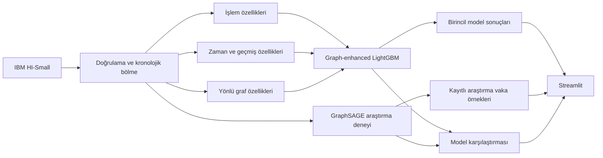

# ARGUS AI

**Graph-Based Financial Crime & Account Network Intelligence**

> Şüpheli işlemlerden şüpheli ağlara.

ARGUS, şüpheli finansal işlemleri işlem geçmişi ve yönlü hesap ağı sinyalleriyle
sıralayan bir karar destek prototipidir. Her vaka; gözlenen işlemler, ağ yapısı ve
model katkılarıyla birlikte banka finansal suç analistine sunulur.

**Samsung Innovation Campus · Pazarlamada Yapay Zekâ · Capstone Projesi · Grup 3**

## Problem

Tekil işlemler olağan görünürken hesaplar arasındaki toplama, dağıtma, hızlı aktarım
ve tekrarlı transfer örüntüleri birlikte şüpheli olabilir. ARGUS iki soruya odaklanır:

- ağ bağlamı, güçlü bir işlem modeline ölçülebilir katkı sağlıyor mu;
- sınırlı inceleme kapasitesinde hangi işlemler ve hesap ağları önce ele alınmalı?

Sistem otomatik yaptırım uygulamaz. Üretilen skorlar yalnızca inceleme önceliğidir.

## ARGUS nasıl çalışır?

1. IBM AML HI-Small işlemleri şema ve veri kalitesi kontrollerinden geçirilir.
2. İşlemler zaman sırası korunarak eğitim, doğrulama ve final test bölümlerine ayrılır.
3. İşlem, zaman, geçmiş ve yönlü graf özellikleri yalnız geçmiş olaylardan üretilir.
4. Transaction LightGBM, graph-enhanced LightGBM ve GraphSAGE aynı kronolojik
   protokolde karşılaştırılır.
5. Graph-enhanced LightGBM birincil sıralama modeli olarak kullanılır.
6. Vaka ekranı gözlenen kanıtı model açıklamasından ayrı gösterir.

## Veri

Çalışmada [IBM AML-Data](https://github.com/IBM/AML-Data) koleksiyonundaki sentetik
**HI-Small** veri kümesi kullanılmıştır.

| Özellik | Değer |
| --- | ---: |
| İşlem sayısı | 5.078.345 |
| Hesap kaydı | 518.581 |
| Pozitif işlem | 5.177 |
| Pozitif oran | %0,101943 |
| Zaman aralığı | 1–18 Eylül 2022 |
| Final test işlemi | 761.639 |

Ham CSV dosyaları lisans ve boyut nedeniyle Git tarafından izlenmez. Yerel dosya
adları, SHA-256 değerleri ve şema bilgisi [`data/README.md`](data/README.md)
dosyasındadır.

## Yöntem

| Katman | Yaklaşım |
| --- | --- |
| İşlem modeli | Logistic Regression, Random Forest, LightGBM |
| Özellik aileleri | İşlem → zaman/geçmiş → yönlü graf |
| Model seçimi | Zamansal çapraz doğrulama ve doğrulama PR-AUC |
| Operasyonel eşik | Doğrulama üzerinde alarm bütçesi ve FPR/Recall dengesi |
| Graf deneyi | Gönderen/alıcı GraphSAGE embedding'leriyle işlem sınıflandırma |
| Açıklanabilirlik | TreeSHAP, GNN yerel duyarlılık ve gözlenen ağ kanıtları |
| Ürün katmanı | Streamlit inceleme kuyruğu ve vaka ekranı |

Tüm öğrenilen dönüşümler eğitim verisine fit edilir; doğrulama ve test yalnız
transform edilir. Aynı zaman damgasındaki işlemler aynı bölümde tutulur. Geçmiş
özellikleri, incelenen işlemle aynı anda veya daha sonra gerçekleşen olayları kullanmaz.

## Final sonuçlar

Final model ve karar eşiği doğrulama sonuçlarıyla dondurulduktan sonra test bölümü
tek kez değerlendirilmiştir. Test sonucu model seçimi veya ayarlama için
kullanılmamıştır.

| Rol | Model | PR-AUC | ROC-AUC | Precision | Recall | F1 | FPR | Alarm |
| --- | --- | ---: | ---: | ---: | ---: | ---: | ---: | ---: |
| **Final model** | **Graph-enhanced LightGBM** | **0,690059** | 0,991272 | 0,178160 | 0,882127 | 0,296448 | 0,008357 | 7.729 |
| Karşılaştırma | Refined transaction LightGBM | 0,530796 | 0,987314 | 0,160723 | 0,814222 | 0,268455 | 0,008732 | 7.908 |
| Araştırma karşılaştırması | GraphSAGE | 0,013417 | 0,826627 | 0,006006 | 0,113389 | 0,011408 | 0,038541 | 29.471 |

Final model için sıralama performansı:

| K | Precision@K | Recall@K | Doğru pozitif |
| ---: | ---: | ---: | ---: |
| 100 | 0,980000 | 0,062780 | 98 |
| 500 | 0,968000 | 0,310058 | 484 |
| 1.000 | 0,839000 | 0,537476 | 839 |

Pozitif oran doğrulamada `%0,099770`, final testte `%0,204953` olmuştur. Bu `2,05×`
prevalans farkı precision ve alarm hacmini etkiler; iki dönem bu bağlamla birlikte
yorumlanmalıdır.

Ayrıntılı sonuçlar:

- [Final değerlendirme özeti](reports/generated/FINAL_EVALUATION_STATUS.md)
- [Final model karşılaştırması](reports/generated/FINAL_MODEL_COMPARISON.md)
- [Model kartı](docs/MODEL_CARD.md)
- [Deney protokolü](docs/EXPERIMENT_PROTOCOL.md)
- [Bilimsel final etiketi: `v1.0-scientific-final`](https://github.com/edasaruhan/SIC_AI_17_Capstone_Group_3/tree/v1.0-scientific-final)

## Graf katkısı

Aynı LightGBM ailesi ve aynı doğrulama protokolüyle yapılan özellik ablasyonu:

| Özellik ailesi | Doğrulama PR-AUC |
| --- | ---: |
| Yalnız işlem | 0,099841 |
| İşlem + zaman/geçmiş | 0,355350 |
| İşlem + zaman/geçmiş + graf | **0,471754** |

Graf özellikleri son iki kol arasında PR-AUC'yi `+0,116404` artırmıştır. Örneklenmiş
GraphSAGE deneyi graph-enhanced LightGBM'i geçmemiştir; bu nedenle araştırma
karşılaştırması olarak tutulur.

## Analist ürünü

Ürün akışı **Public Website → Corporate Login → Analyst Portal** şeklindedir. Kurumsal giriş,
üretim kimlik sağlayıcısına bağlı olmayan güvenli bir demo oturumudur. Streamlit uygulaması
kayıtlı artifact'ları salt okunur biçimde kullanır ve sayfa açılışında model eğitmez.
Graph-enhanced LightGBM birincil sıralama modelidir. Uygulamadaki mevcut kayıtlı vaka
örnekleri GraphSAGE araştırma karşılaştırmasına ait artifact setinden alınır.

- **Overview:** inceleme bekleyen vakalar, öncelik dağılımı ve oturum etkinliği;
- **Investigations:** aranabilir, filtrelenebilir ve sıralanabilir vaka çalışma listesi;
- **Case Investigator:** yönlü hesap ağı, işlem zaman çizelgesi, gözlenen kanıtlar ve
  oturuma özel analist aksiyonları;
- **Model Evidence:** dondurulmuş final model, transaction baseline ve GraphSAGE
  karşılaştırması.

Kurumsal giriş bilgileri ve vaka aksiyonları kalıcı olarak saklanmaz; çıkış yapıldığında demo
oturumu temizlenir.

## Mimari



Ana bileşenler:

```text
configs/             Deney ayarları
data/README.md       Veri şeması ve yerel dosya bilgisi
docs/                Protokol, model kartı ve teknik kararlar
reports/coursework/  Beş temel ders teslimi
reports/generated/   Final bilimsel sonuç özetleri
scripts/             Pipeline, doğrulama ve kalite komutları
src/argus/           Veri, model, GNN, vaka ve uygulama kodu
tests/               Otomatik testler
artifacts/           Yerel çalışma çıktıları; Git dışında
demo/artifacts/      Temiz klon için sentetik ürün demosu
```

## Hızlı başlangıç

Python `3.11–3.13` desteklenir.

```powershell
git clone https://github.com/edasaruhan/SIC_AI_17_Capstone_Group_3
Set-Location SIC_AI_17_Capstone_Group_3
py -3.12 -m venv .venv
.\.venv\Scripts\python.exe -m pip install --upgrade pip
.\.venv\Scripts\python.exe -m pip install -e ".[graph,app,dev]"
```

GNU Make bulunan ortamlarda aynı tam geliştirme kurulumu `make setup`, çekirdek ve
geliştirme araçlarıyla sınırlı hafif kurulum ise `make setup-core` ile yapılabilir. Python 3.12
üzerinde doğrulanmış doğrudan bağımlılık sürümleriyle tekrarlanabilir QA kurulumu için
`make setup-locked` kullanılır. Bu constraints dosyası yazılım kalite ortamını sabitler; frozen
bilimsel eğitim çalışmasını yeniden üretme iddiası taşımaz.

HI-Small dosyalarını aşağıdaki yerel yollara ekleyin:

```text
data/raw/HI-Small_Trans.csv
data/raw/HI-Small_accounts.csv
```

Veri ve kalite kontrolleri:

```powershell
.\.venv\Scripts\python.exe -m pytest -q
.\.venv\Scripts\python.exe -m pytest --cov=argus --cov-report=term-missing --cov-fail-under=76
.\.venv\Scripts\python.exe -m ruff check --no-cache src scripts tests app.py
.\.venv\Scripts\python.exe -m ruff format --no-cache --check src scripts tests app.py
.\.venv\Scripts\python.exe -m pip check
.\.venv\Scripts\python.exe scripts/run_quick_pipeline.py
.\.venv\Scripts\python.exe scripts/verify_run.py
```

Final test pipeline'ı tekrar çalıştırılmaz. Kayıtlı final sonuçlarının salt-okunur
doğrulaması için:

```powershell
.\.venv\Scripts\python.exe scripts/verify_final_evaluation.py --config configs/final_evaluation.yaml
```

`artifacts/` veri, model, tahmin ve ekran görüntüsü çıktıları boyut ve veri politikası
nedeniyle Git'e eklenmez. Bu nedenle temiz bir klonda yalnızca özet raporlar bulunur;
artifact içindeki kanıt yolları, doğrulanmış yerel paket geri yüklendiğinde kullanılabilir.

Yerel final artifact'ları mevcutsa uygulama şu komutla açılır:

```powershell
$env:ARGUS_ARTIFACT_DIR = (Resolve-Path artifacts/sprint5)
.\.venv\Scripts\streamlit.exe run app.py
```

Gerçek artifact paketi bulunmayan temiz bir klonda uygulama otomatik olarak
`demo/artifacts/dashboard_bundle.json` içindeki küçük sentetik ürün demosunu açar. Bu vakalar
yalnızca arayüz akışını göstermek içindir; IBM HI-Small kaydı, frozen model çıktısı veya bilimsel
sonuç değildir. `ARGUS_ARTIFACT_DIR` verilirse açıkça seçilen gerçek paket her zaman önceliklidir.
Demo vaka içeriğinin provenance sözleşmesi otomatik testlerle, lint ve en az `%76` coverage
eşiği ise GitHub Actions kalite iş akışıyla korunur.

Tam çalıştırma sırası [`docs/EXPERIMENT_PROTOCOL.md`](docs/EXPERIMENT_PROTOCOL.md)
dosyasındadır.

## Ders teslimleri

| Teslim | Dosya |
| --- | --- |
| Idea Proposal | [PDF](reports/coursework/01_Idea_Proposal/ARGUS_AI_Capstone_Proposal.pdf) · [PPTX](reports/coursework/01_Idea_Proposal/ARGUS_AI_Capstone_Project_Presentation.pptx) |
| Literature, Data & Technology Review | [DOCX](reports/coursework/02_Literature_Data_Technology/ARGUS_AI_Literature_Data_Technology_Review.docx) |
| Concept Note & Implementation Plan | [DOCX](reports/coursework/03_Concept_Implementation/ARGUS_AI_Concept_Note_and_Implementation_Plan.docx) |
| Data Preparation & Feature Engineering | [DOCX](reports/coursework/04_Data_Preparation/ARGUS_AI_Veri_Hazirlama_ve_Ozellik_Muhendisligi.docx) |
| Model Refinement & Test Submission | [PDF](reports/coursework/05_Model_Refinement_and_Test_Submission/ARGUS_Model_Refinement_ve_Test_Submission_TR.pdf) |

Ayrı indeks: [`reports/coursework/README.md`](reports/coursework/README.md).

## Sınırlılıklar ve sorumlu kullanım

- HI-Small sentetik bir veri kümesidir; sonuçlar gerçek banka verisine doğrudan
  genellenemez.
- Pozitif sınıf son derece dengesizdir. Accuracy tek başına anlamlı bir başarı
  ölçütü değildir.
- GraphSAGE eğitimi deterministik örneklenmiş bir graf üzerinde yapılmıştır; sonuç
  tam-graf eğitim iddiası taşımaz.
- TreeSHAP ve GNN duyarlılığı model davranışını açıklar, nedensellik göstermez.
- Model skoru suç kanıtı değildir ve otomatik bloke etme ya da yaptırım amacıyla
  kullanılmamalıdır.
- Her yüksek öncelikli vaka, kaynak kayıtlarla birlikte uzman analist tarafından
  incelenmelidir.

## Ekip

| Ekip üyesi | GitHub |
| --- | --- |
| **Gizem Özcan** | [@GizemmOzcan](https://github.com/GizemmOzcan) |
| **Ayşe Ulaşlı** | [@aaayseee](https://github.com/aaayseee) |

## Lisans

Kaynak kod [MIT Lisansı](LICENSE) ile sunulur. IBM AML-Data veri kümesi kendi lisans
koşullarına tabidir ve bu deponun MIT lisansı kapsamında değildir.
