# ARGUS AI — Graph-Based Financial Crime and Account Network Intelligence

> Move from suspicious transactions to suspicious networks.

ARGUS AI is a reproducible, human-in-the-loop research prototype for prioritizing
financial-crime investigations. It represents transfers as a directed account
network and is designed to test whether graph context adds measurable value over
strong transaction-level baselines.

ARGUS produces evidence for analyst review. It does **not** determine that a person
or account is criminal, guilty, or suitable for an automatic adverse action. A high
score means elevated investigation priority, not a legal conclusion.

## Current status

This checkout has completed **Sprint 1: Repository Foundation + Data Proof**,
**Sprint 2: Baseline + Model Exploration**, **Sprint 3: Model Refinement + Graph
Value Experiment**, and **Sprint 4: GraphSAGE + Product Layer**. The executed
Sprint 4 run, independent artifact verification, and repository quality suite all
passed. The final-test period remains sealed: it was not fitted, transformed,
included in a graph, scored, tuned against, or evaluated.

| Item | Status | Evidence |
| --- | --- | --- |
| Sprint 1 acceptance criteria | **PASS (14/14)** | Final evidence ledger linked below |
| Full-file IBM HI-Small source audit | PASS | `artifacts/full/raw_data_audit.json` |
| Source data at documented local paths | PASS | Size, schema, and SHA-256 verified |
| Sprint 1 final test suite | PASS | 34 passed in 25.36 seconds |
| Quality checks | PASS | Ruff lint, Ruff format, and `pip check` |
| Quick pipeline | PASS | 10,000 rows, 52 columns, 11.197340699996857 seconds |
| Saved quick-run verification | PASS | 38 manifest-hashed payloads verified |
| Generated quick EDA | PASS | 13 PNG figures plus machine-readable tables/JSON |
| Full Sprint 1 pipeline | PASS | 5,078,345 rows, 52 columns, 304.93406899999536 seconds |
| Saved full-run verification | PASS | Four outputs contain the same 5,078,345 unique transaction IDs |
| Full EDA | PASS | Exact all-row tables plus labeled 100,000-row descriptive sample |
| Sprint 2 transaction baselines | **PASS** | Logistic, Random Forest, and LightGBM ran on frozen train/validation data |
| Transaction Baseline Champion | **Random Forest** | Validation average precision 0.08859105087174989 |
| Saved Sprint 2 verification | PASS | 761,749 validation predictions and validation-only reselection verified |
| Sprint 2 final quality suite | PASS | 81 passed in 19.87 seconds; Ruff lint/format and `pip check` passed |
| Final-test model access | **NOT USED** | No test feature matrix, prediction, inference, or test metric exists |
| Sprint 3 refinement / graph-value experiment | **PASS** | All 15 acceptance gates passed |
| Refined Transaction Baseline Champion | **LightGBM** | Validation AP 0.35535042; selected using validation only |
| Same-model graph-value experiment | **PASS** | LightGBM B AP 0.35535042; C AP 0.47175420; delta +0.11640378 |
| Sprint 3 final quality suite | **PASS** | 207 passed in 30.74 seconds; artifact verification, Ruff lint/format, and `pip check` passed |
| Sprint 4 GraphSAGE + Product Layer | **PASS (19/19)** | Sampled GraphSAGE training, full frozen-validation scoring, cases, evidence, explanations, and saved-artifact UI completed |
| GraphSAGE validation result | **BELOW BOTH REFERENCES** | AP 0.00943876; no GNN superiority claim |
| Sprint 4 product evidence | **PASS** | 20 real validation cases; at least 7 observed evidence items per case; deterministic no-LLM notes |
| Sprint 4 Streamlit application | **PASS** | Four saved-artifact screens; no model training on page load |
| Sprint 4 final quality suite | **PASS** | 289 passed in 34.21 seconds; artifact verification, four-screen Streamlit smoke, Ruff lint/format, and `pip check` passed |

The completed-run evidence ledgers are
[`SPRINT_1_STATUS.md`](reports/generated/SPRINT_1_STATUS.md),
[`SPRINT_2_STATUS.md`](reports/generated/SPRINT_2_STATUS.md),
[`SPRINT_3_STATUS.md`](reports/generated/SPRINT_3_STATUS.md), and
[`SPRINT_4_STATUS.md`](reports/generated/SPRINT_4_STATUS.md).

## Research question

The final project is intended to answer, with executable evidence:

> Does graph information improve the prioritization of suspicious financial
> transactions compared with the strongest transaction-only baseline under severe
> class imbalance and limited analyst capacity?

Sprint 2 established the fixed transaction-only reference. In Sprint 3, the
same-family LightGBM comparison measured validation AP 0.35535042 for B
(transaction + temporal/history) and 0.47175420 for C (B + graph), an absolute
delta of +0.11640378. Sprint 4 then evaluated a transaction-edge GraphSAGE
classifier on the same 761,749 frozen validation transactions. Its AP was
0.00943876, well below both frozen LightGBM references, so this run provides no
evidence that the sampled GNN improves prioritization. These are validation
results for this synthetic dataset, not production-performance claims.

## Implemented architecture through Sprint 4

```mermaid
flowchart LR
    T[HI-Small transactions\nlocal, gitignored] --> L[Schema-aware loader]
    A[HI-Small accounts\nlocal, gitignored] --> L
    L --> V[Validation and canonicalization]
    V --> S[Chronological\ntrain / validation / test]
    V --> E[Executable EDA]
    S --> F[Transaction and time features]
    F --> H[Strictly-prior history features]
    H --> G[Directed fan-in / fan-out features]
    E --> Q[Reproducible artifacts]
    G --> Q
    Q --> P[Train-only preprocessing]
    P --> M[Three transaction baselines]
    M --> C[Validation-only champion]
    C --> R[Expanding temporal CV\nand bounded refinement]
    R --> X[Same-model A / B / C\ngraph-value experiment]
    X --> O[Validation-only\noperating threshold]
    S --> SG[Deterministically sampled\ntrain-only message graph]
    SG --> N[GraphSAGE node embeddings]
    N --> EC[Sender + receiver embeddings\nand transaction-edge classifier]
    EC --> VC[Full frozen-validation scoring]
    O --> PB[Saved-artifact product layer]
    VC --> PB
    PB --> UI[Streamlit queue, investigator,\ncomparison, and executive screens]
```



Every historical or graph-history feature for an event at time `t` may use only
events at times strictly earlier than `t`. Events sharing the same timestamp see
the same prior state. Sprint 2 uses transaction, time, and strictly-prior account-
history signals; it deliberately withholds the five graph-history columns from
the Sprint 2 baselines. Sprint 3 adds them only in the controlled C-family arm,
with identical model family, selected parameters, frozen outer split, and
evaluation protocol used for the B-versus-C comparison.

Sprint 4 preserves the IBM transaction label as an edge target; it does not invent
an unsupported account-level fraud label. GraphSAGE message passing uses only
sampled outer-train history. Validation edges never enter that graph, while all
761,749 frozen validation transactions are scored and compared against the two
immutable Sprint 3 references. The product layer reads saved results and never
trains a model while a page is opening.

## Verified source-data facts

These figures are **full-file audit facts**, not quick-pipeline sample results. The
audit streamed all records read-only from the user-supplied files on 2026-09-06.
The project-generated report at `artifacts/full/raw_data_audit.json` independently
reproduced the core counts, ranges, duplicates, hashes, and account references.

| Fact | `HI-Small_Trans.csv` | `HI-Small_accounts.csv` |
| --- | ---: | ---: |
| Bytes | 475,664,283 | 34,053,187 |
| Data rows | 5,078,345 | 518,581 |
| Exact full-row duplicate occurrences after first | 9 | 0 |
| Empty or whitespace-only fields | 0 | 0 |
| Malformed-width rows | 0 | 0 |
| SHA-256 | `b19d39f515523373f991b689c07e11e7b0b95c17a2c27a87d91584ae16c5b040` | `786808526e33cfc441212dd6fccda7edfc24172149bed59c6ef59b186836b014` |

Additional verified transaction facts:

- timestamp range: `2022/09/01 00:00` through `2022/09/18 16:18`;
- all 5,078,345 timestamps match `%Y/%m/%d %H:%M`;
- label `0`: 5,073,168 rows (99.898057339547%);
- label `1`: 5,177 rows (0.101942660453%);
- both amount fields contain 5,078,345 finite, strictly positive values;
- negative, zero, non-finite, or unparsable amounts: 0;
- observed minimum and maximum in each amount field: `0.000001` and
  `1,046,302,363,293.48`.

The nine exact duplicate transaction pairs all have label `0`. They are reported,
not silently removed: repeated transfers can be legitimate behavior and duplicate
policy must preserve a traceable raw identity.

See [`data/README.md`](data/README.md) for provenance, schema, placement, and the
critical bank-ID normalization rule.

## Verified quick-run evidence

The successful quick pipeline used the chronological prefix configured in
`configs/quick.yaml`. These are sampled engineering results and must not be
generalized to the full 5,078,345-row transaction source.

| Quick-run fact | Verified value |
| --- | ---: |
| Rows loaded and featured | 10,000 |
| Final table columns | 52 |
| Labels | 9,999 label `0`; 1 label `1` |
| Timestamp scope | `2022-09-01 00:00`–`00:29` |
| Runtime | 11.197340699996857 seconds |
| Generated artifacts including run manifest | 39 |
| Manifest-hashed payloads independently verified | 38 |
| EDA PNG figures | 13 |

| Partition | Rows | Timestamp range | Positive labels |
| --- | ---: | --- | ---: |
| Train | 7,011 | `00:00`–`00:20` | 0 |
| Validation | 1,657 | `00:21`–`00:25` | 1 |
| Test | 1,332 | `00:26`–`00:29` | 0 |

Timestamp groups remained intact, both chronological boundary inequalities passed,
and no transaction ID overlapped partitions. Because train and test contain no
positive example, this smoke-run split is not suitable for model evaluation; no
model metric is derived from it.

## Verified full-run evidence

The successful `configs/full.yaml` run used DuckDB 1.5.5 with a `2GB` memory
limit, one ingestion thread, one processing thread, external spill enabled, and
Zstandard-compressed Parquet output. Preprocessing, chronological splitting, and
all 34 engineered features were computed from all **5,078,345** transactions;
feature engineering was not sampled.

| Full-run fact | Verified value |
| --- | ---: |
| Canonical rows | 5,078,345 |
| Feature rows / columns | 5,078,345 / 52 |
| Feature engineering sampled | `false` |
| Exact duplicate rows observed and preserved | 9 |
| Runtime | 304.93406899999536 seconds |
| Manifest-hashed payloads | 54 |
| Published files including run manifest | 55 |

| Partition | Rows | Timestamp range | Positive labels |
| --- | ---: | --- | ---: |
| Train | 3,554,957 | `2022-09-01 00:00`–`2022-09-07 14:55` | 2,856 |
| Validation | 761,749 | `2022-09-07 14:56`–`2022-09-09 03:16` | 760 |
| Test | 761,639 | `2022-09-09 03:17`–`2022-09-18 16:18` | 1,561 |

The SQL verification report reconciles 5,078,345 rows and 5,078,345 unique
transaction IDs in the canonical, feature, split, and graph-edge Parquet files.
Timestamp groups remain intact, boundaries are strictly chronological, and no
transaction overlaps partitions.

Full EDA has two deliberately separate scopes:

- `full_exact/` contains all-row DuckDB aggregates for class/rate, amounts, daily
  activity, formats, currencies, banks, repeated directed pairs, exact node
  degree/counterparty counts, and full dataset/graph counts;
- `sample_descriptive/` contains plots and NetworkX analyses from exactly 100,000
  target-independent, hash-ranked transaction edges. NetworkX is capped at 50,000
  edges. These graph statistics describe the sample and are not population
  estimates.

The 100,000-row sample is reproducible via
`ORDER BY hash(transaction_id), transaction_id`; its transaction-ID digest is
`e81cee70a8c52d088f5c7db21ba61bbabe2bf82fb32a5be8c73aca854400ded5`.
The first full attempt used a `1GB` DuckDB limit and two threads, completed the
history stages, then exhausted memory during the six-way feature export join. The
successful retry used `2GB` and one thread, materialized the join before sorted
export, and released large temporary tables before sampled plotting.

## Verified Sprint 2 baseline evidence

The executable `configs/baseline.yaml` run consumed the frozen Sprint 1 feature and
split artifacts without sampling or changing their chronological boundaries. All
learned preprocessing state was fit on the 3,554,957 training rows. The 761,749
validation rows were transform-only; the 761,639 final-test rows were not
materialized or scored.

The common 74-column model matrix contains numeric transaction/time/history
signals, four missing indicators, train-vocabulary one-hot encodings for currencies
and payment format, and train-frequency encodings for sender/receiver bank. Unknown
categories map to the declared safe defaults. The target, transaction/provenance
identifiers, timestamp, account/node IDs, and these five graph-history fields are
forbidden predictors:

```text
sender_prior_fan_out_degree
sender_prior_fan_in_degree
receiver_prior_fan_out_degree
receiver_prior_fan_in_degree
pair_previous_transfer_count
```

Logistic Regression is implemented explicitly as
`sklearn.linear_model.SGDClassifier(loss="log_loss")` for bounded full-data
training. It uses balanced class weights and reached its configured 20-iteration
limit before convergence, so its result is an initial baseline rather than a
fully refined linear model. Random Forest uses balanced subsampling; LightGBM uses
the training-only negative/positive ratio as `scale_pos_weight`. No oversampling,
hyperparameter search, calibration, or threshold optimization was performed.
LightGBM was selected once, instead of XGBoost, as the boosting baseline because
its CPU histogram implementation supported the planned full-data, deterministic
single-thread, bounded-memory run. XGBoost was not executed, so this is an
engineering choice rather than measured evidence that LightGBM is superior.

All table entries below are generated validation evidence. PR-AUC means non-
interpolated average precision and is the primary selection metric. Precision,
recall, F1, FPR, and alerts use the fixed, unoptimized score threshold `0.5`.

| Model | PR-AUC (AP) | ROC-AUC | Precision | Recall | F1 | FPR | Alerts |
| --- | ---: | ---: | ---: | ---: | ---: | ---: | ---: |
| Random Forest | 0.08859105 | 0.97497347 | 0.03127670 | 0.72236842 | 0.05995741 | 0.02234461 | 17,553 |
| Logistic Regression | 0.00663424 | 0.91808364 | 0.00491412 | 0.96184211 | 0.00977828 | 0.19451530 | 148,755 |
| LightGBM | 0.00547556 | 0.85107181 | 0.00507521 | 0.87368421 | 0.01009180 | 0.17105109 | 130,832 |

Random Forest is the **Transaction Baseline Champion** because its validation
average precision is highest. Test metrics played no role: Sprint 2 performed no
test inference and produced no test prediction artifact. Top-K metrics for
`K = 100, 500, 1000` are saved for every candidate using score descending and
`source_row_number` ascending as the deterministic tie-break.

That tie-break is materially important for two uncalibrated candidates: Logistic
Regression assigns exact score `1.0` to 60,119 validation rows (427 positives), and
LightGBM assigns it to 108,347 rows (663 positives). Their reported K cutoffs fall
inside those large tied groups, so row identity determines which equally scored
transactions enter K; their Precision@K/Recall@K values do not demonstrate within-
tie ranking ability. Random Forest has no exact score-1 rows. Champion selection
uses tie-aware average precision and is not determined by this row tie-break.

The frozen label prevalence changes materially over time:

| Partition | Rows | Positives | Positive rate |
| --- | ---: | ---: | ---: |
| Train | 3,554,957 | 2,856 | 0.080338524% |
| Validation | 761,749 | 760 | 0.099770397% |
| Test metadata | 761,639 | 1,561 | 0.204952740% |

The validation rate is 1.2418748968 times the train rate, while the later test rate
is 2.0542440105 times the validation rate. Precision and fixed-threshold alert
volume depend on prevalence, so the validation values above must not be projected
unchanged onto the untouched test period. The splits were neither shuffled nor
rebalanced.

The full Sprint 2 command took 389.0078022000016 seconds. Model fit times were
56.820384400001785 seconds for Logistic Regression, 177.2493680999978 seconds for
Random Forest, and 100.01021949999995 seconds for LightGBM. The independent
artifact verifier recomputed validation AP/ROC-AUC from saved scores, deserialized
all three models, repeated validation-only champion selection, confirmed zero test
prediction artifacts, and returned `PASS`.

## Verified Sprint 4 GraphSAGE and product evidence

The executable `configs/sprint4.yaml` run kept the Sprint 3 refined transaction
LightGBM and graph-enhanced LightGBM outputs frozen. GraphSAGE was trained as a
transaction/edge classifier: learned sender and receiver node embeddings are
combined with transaction features to score the transaction label. No account-
level fraud label was derived or used.

Resource limits made full-graph GraphSAGE training inappropriate on the available
workstation, so the run uses a disclosed deterministic training sample rather than
presenting a subset as a full-data GNN result:

- the train-prefix message graph contains 150,000 of 1,422,288 eligible edges;
- the validation-inference history graph contains 300,000 of 3,554,957 outer-train
  edges;
- the supervised training set contains 52,396 transactions: all 2,396 positives
  after the message-graph cutoff plus 50,000 deterministic negatives;
- context edges are selected without target labels by stable MD5 transaction-ID
  order;
- validation evaluation is not sampled: all 761,749 frozen validation rows,
  including all 760 positives, are scored.

The training message graph ends at `2022-09-02 09:27`; supervised edges begin at
`2022-09-02 09:28`. Validation inference uses sampled outer-train edges only, so
no validation transaction participates in message passing. Directed endpoints and
repeated transfers are retained.

| Model | PR-AUC (AP) | ROC-AUC | Precision | Recall | F1 | FPR | Alerts |
| --- | ---: | ---: | ---: | ---: | ---: | ---: | ---: |
| Graph-enhanced LightGBM | 0.47175420 | 0.98635944 | 0.11631632 | 0.76447368 | 0.20191138 | 0.00580035 | 4,995 |
| Refined transaction LightGBM | 0.35535042 | 0.98179242 | 0.10302170 | 0.66842105 | 0.17852750 | 0.00581217 | 4,931 |
| GraphSAGE edge classifier | 0.00943876 | 0.84664170 | 0.00969110 | 0.06315789 | 0.01680378 | 0.00644556 | 4,953 |

All three rows use the identical frozen validation identities and the same
validation-only 5,000-alert / 1% FPR operating-point rule. Raw GraphSAGE logits
are used for ranking. The GNN underperforms both frozen LightGBM references,
including the transaction-only reference; it is retained as a reproducible
negative experimental result, not described as a champion.

Sprint 4 generated 20 investigation cases from real saved validation scores. Each
case contains at least seven concrete observed-evidence items, keeps observed facts
separate from model-derived explanation, and has a deterministic no-LLM narrative.
LightGBM explanations use native `pred_contrib` TreeSHAP with a verified additivity
check. GraphSAGE explanations are explicitly labeled local gradient-times-input
sensitivity, not SHAP, causal explanation, or proof of wrongdoing.

GraphSAGE node structure uses directed in/out degree plus deterministic composite-
identity signals. Node-level monetary sums are deliberately excluded because no FX
table exists and cross-currency totals would be scientifically invalid. The saved
sigmoid output is also labeled an **uncalibrated ranking score**, not an event
probability, because training combines deterministic negative sampling with
positive class weighting.

The Streamlit application reads only persisted Sprint 4 artifacts and exposes four
screens: **Executive Dashboard**, **Investigation Queue**, **Case Investigator**,
and **Model Comparison**. It does not train or rescore models on page load. The
end-to-end Sprint 4 pipeline completed in 49.928 seconds; independent artifact
verification passed, and the quality suite passed 289 tests in 34.21 seconds plus
a four-screen saved-artifact Streamlit smoke test, Ruff lint/format, and `pip
check`. Final-test features, labels, graph construction, predictions, and metrics
remain unopened.

## Repository map

```text
configs/                    versioned quick/full/baseline/refinement/Sprint 4 settings
data/README.md              source placement, provenance, and raw schema
data/raw/                   local IBM files; ignored by Git
docs/                       scope, dictionary, protocol, roadmap, decisions
reports/existing_coursework preserved academic source documents
reports/generated/          generated engineering status reports
scripts/                    data, model, GraphSAGE, verification, and quality entry points
src/argus/                  reusable data, model, GNN, case, evidence, and app code
tests/                      automated data, leakage, model, GNN, product, and UI checks
artifacts/quick/             deterministic quick-run outputs; ignored by Git
artifacts/full/              full-data outputs; ignored by Git
artifacts/sprint2/           baseline outputs; ignored by Git except `.gitkeep`
artifacts/sprint3/           refinement/ablation outputs; ignored by Git except `.gitkeep`
artifacts/sprint4/           GraphSAGE/product outputs; ignored by Git except `.gitkeep`
app.py                       saved-artifact Streamlit application entry point
```

Raw/interim/processed data and generated artifacts are deliberately excluded by
`.gitignore`. Never force-add them to version control.

## Quick start

The commands below reproduce the verified Sprint 1 data path, Sprint 2 baseline,
Sprint 3 refinement experiment, and Sprint 4 GraphSAGE/product pipeline.

### 1. Open the repository

```powershell
Set-Location -LiteralPath 'C:\Users\MONSTER\OneDrive - Istanbul Kultur Universitesi\Masaüstü\ARGUS PROJECET'
```

### 2. Place the raw files

The two exact local paths expected by Sprint 1 are:

```text
data/raw/HI-Small_Trans.csv
data/raw/HI-Small_accounts.csv
```

Do not rename, edit, or commit these files. Verify their hashes against the table
above before treating a run as comparable.

### 3. Create an environment and install

Python 3.11–3.13 is supported by the package metadata.

```powershell
py -3.12 -m venv .venv
.\.venv\Scripts\python.exe -m pip install --upgrade pip
.\.venv\Scripts\python.exe -m pip install -e ".[graph,app,dev]"
```

### 4. Run quality checks and the deterministic pipelines

```powershell
.\.venv\Scripts\pytest.exe -q
.\.venv\Scripts\python.exe -m ruff check --no-cache src scripts tests app.py
.\.venv\Scripts\python.exe -m ruff format --no-cache --check src scripts tests app.py
.\.venv\Scripts\python.exe -m pip check
.\.venv\Scripts\python.exe scripts/run_quick_pipeline.py
.\.venv\Scripts\python.exe scripts/verify_run.py
.\.venv\Scripts\python.exe scripts/run_full_pipeline.py
.\.venv\Scripts\python.exe scripts/train_baselines.py --config configs/baseline.yaml
.\.venv\Scripts\python.exe scripts/verify_baselines.py --config configs/baseline.yaml
.\.venv\Scripts\python.exe scripts/validate_sprint2.py --config configs/baseline.yaml
.\.venv\Scripts\python.exe scripts/train_refined_models.py --config configs/refinement.yaml
.\.venv\Scripts\python.exe scripts/verify_refinement.py --config configs/refinement.yaml
.\.venv\Scripts\python.exe scripts/validate_sprint3.py --config configs/refinement.yaml
.\.venv\Scripts\python.exe scripts/train_graphsage_product.py --config configs/sprint4.yaml
.\.venv\Scripts\python.exe scripts/verify_sprint4.py --config configs/sprint4.yaml
.\.venv\Scripts\python.exe scripts/validate_sprint4.py --config configs/sprint4.yaml
.\.venv\Scripts\python.exe scripts/smoke_streamlit_sprint4.py --artifact-root artifacts/sprint4/product
.\.venv\Scripts\streamlit.exe run app.py
```

Equivalent Make targets are:

```powershell
make test
make quick
```

### 5. Optional focused commands

```powershell
.\.venv\Scripts\python.exe scripts/validate_data.py --config configs/full.yaml
.\.venv\Scripts\python.exe scripts/run_eda.py --config configs/quick.yaml
.\.venv\Scripts\python.exe scripts/audit_raw_data.py
```

`quick.yaml` uses seed `42` and at most 10,000 source rows for fast development.
`full.yaml` disables preprocessing and feature sampling and is the full HI-Small
data contract. `baseline.yaml` inherits that contract, freezes upstream hashes,
and declares the train/validation-only model protocol. `refinement.yaml` inherits
the frozen baseline contract and declares bounded candidate grids, three expanding-
window temporal folds inside outer train, validation-only operating-point rules,
and the same-model feature-family ablation. `sprint4.yaml` freezes the Sprint 3
references and declares deterministic graph sampling, train-only GraphSAGE message
passing, full-validation edge scoring, saved case/evidence generation, and the
final-test stop boundary. The full EDA manifest
separately labels exact all-row tables and the deterministic sampled plot/NetworkX
scope. A quick or sampled artifact must never be described as a full-population
result.

## Generated experiment outputs

The verified Sprint 1 through Sprint 4 runs generated these core paths:

```text
artifacts/quick/run_manifest.json
artifacts/quick/metadata/split_metadata.json
artifacts/quick/tables/transactions_clean.csv
artifacts/quick/tables/transaction_features.csv
artifacts/quick/tables/split_manifest.csv
artifacts/quick/account_reference_report.json
artifacts/quick/raw_validation_report.json
artifacts/quick/canonical_validation_report.json
artifacts/quick/resolved_config.json
artifacts/quick/tables/graph_edges.csv
artifacts/quick/eda/dataset_profile.json
artifacts/quick/eda/eda_manifest.json
artifacts/quick/eda/figures/             13 generated PNG files
artifacts/quick/eda/tables/              12 generated CSV tables
artifacts/full/raw_data_audit.json
artifacts/full/run_manifest.json
artifacts/full/verification_report.json
artifacts/full/metadata/split_metadata.json
artifacts/full/tables/transactions_clean.parquet
artifacts/full/tables/transaction_features.parquet
artifacts/full/tables/split_manifest.parquet
artifacts/full/tables/graph_edges.parquet
artifacts/full/eda/full_eda_manifest.json
artifacts/full/eda/full_exact/dataset_graph_counts.json
artifacts/full/eda/full_exact/tables/
artifacts/full/eda/sample_descriptive/figures/
artifacts/full/eda/sample_descriptive/tables/
artifacts/sprint2/run_manifest.json
artifacts/sprint2/verification_report.json
artifacts/sprint2/quality_report.json
artifacts/sprint2/model_comparison.json
artifacts/sprint2/model_comparison.csv
artifacts/sprint2/transaction_baseline_champion.json
artifacts/sprint2/validation_predictions.parquet
artifacts/sprint2/preprocessing/manifest.json
artifacts/sprint2/models/
artifacts/sprint2/figures/
artifacts/sprint2/final_test_policy.json
artifacts/sprint3/run_manifest.json
artifacts/sprint3/temporal_cv/folds.json
artifacts/sprint3/temporal_cv/trials.csv
artifacts/sprint3/temporal_cv/candidate_summary.csv
artifacts/sprint3/temporal_cv/selected_candidates.json
artifacts/sprint3/refined_model_comparison.csv
artifacts/sprint3/refined_transaction_champion.json
artifacts/sprint3/baseline_vs_refined.csv
artifacts/sprint3/ablation/feature_family_ablation.csv
artifacts/sprint3/ablation/graph_value_conclusion.json
artifacts/sprint3/saturation/sprint2_vs_refined.json
artifacts/sprint3/threshold/analysis.json
artifacts/sprint3/validation_predictions.parquet
artifacts/sprint3/final_test_policy.json
artifacts/sprint4/run_manifest.json
artifacts/sprint4/verification_report.json
artifacts/sprint4/quality_report.json
artifacts/sprint4/final_test_policy.json
artifacts/sprint4/sampling/sampling_disclosure.json
artifacts/sprint4/model/graphsage.pt
artifacts/sprint4/model/inference_node_embeddings.npy
artifacts/sprint4/validation_predictions.parquet
artifacts/sprint4/model_comparison.csv
artifacts/sprint4/thresholds.json
artifacts/sprint4/product/cases.json
artifacts/sprint4/product/investigation_queue.csv
artifacts/sprint4/product/tree_shap_explanations.json
artifacts/sprint4/product/graphsage_explanations.json
artifacts/sprint4/product/dashboard_summary.json
```

`run_manifest.json` inventories and hashes 38 payloads; together with the manifest,
the quick command produced 39 artifacts. The pre-existing `.gitkeep` is not a run
artifact. `verify_run.py` checked all 38 hashes, the 10,000-row split manifest,
strict chronology, disjoint transaction IDs, and all 13 PNG files.

The full manifest inventories and hashes 54 payloads; with the run manifest the
published evidence set contains 55 output files (excluding `.gitkeep`). That
inventory includes the full raw-data
audit created before the preprocessing retry, so 55 is not a claim that the
successful retry alone created every file. `verification_report.json` performs DuckDB row,
distinct-ID, schema, set-difference, split-count, and chronology checks without
building Python identifier sets.

The Sprint 2 manifest inventories 26 non-manifest artifacts after independent
verification. `verification_report.json` checks all saved validation identities,
recomputes primary/secondary ranking metrics from 761,749 persisted prediction
rows, deserializes each fitted estimator, repeats champion selection using only
validation AP, and confirms that no test prediction artifact exists.
The precision-recall PNG is display-only and uses endpoint-preserving deterministic
decimation to at most 10,000 plotted points per model; AP, ROC-AUC, and all saved
metrics still use all 761,749 validation rows.
The final repository suite passed 81 tests in 19.87 seconds; Ruff lint/format and
`pip check` also passed.

Sprint 3 artifacts are generated, not hand-authored. The completed training run
used bounded tuning on three expanding chronological folds contained entirely
within outer train, refit selected Logistic Regression, Random Forest, and LightGBM
candidates on outer train, evaluated only outer validation, and ran the
feature-family ablation. Independent verification passed, as did 207 tests, Ruff
lint/format, and `pip check`. The complete runtime and metric ledger is
[`SPRINT_3_STATUS.md`](reports/generated/SPRINT_3_STATUS.md).

Sprint 4 artifacts are likewise executable outputs. The saved checkpoint,
inference adjacency, node embeddings, full-validation score table, model
comparison, threshold analysis, cases, explanations, and dashboard tables are
hash-inventoried by `run_manifest.json`. `verification_report.json` rechecks the
artifact inventory, frozen Sprint 3 reference hash, 761,749 validation identities,
recomputed AP, model/embedding shapes, top-20 case identities, explanation schema,
saved-artifact UI contract, and the final-test seal. The complete disclosure,
runtime, metrics, and 19-gate acceptance ledger is
[`SPRINT_4_STATUS.md`](reports/generated/SPRINT_4_STATUS.md).

## Experiment rules

- Split chronologically; do not use a shuffled row split as the primary protocol.
- Keep identical timestamps together so train/validation/test boundaries remain
  strictly ordered.
- Fit learned transformations on training data only. Sprint 2 records this fitted
  state separately and applies it unchanged to validation.
- Select refinement candidates with expanding temporal folds contained within
  outer train; use outer validation for the final comparison and operating point.
  Keep final-test features and labels untouched throughout Sprint 3.
- Rank Logistic Regression and LightGBM by raw decision margin where available.
  Probability outputs remain diagnostics: finite-K results that cut through a tied
  score group must report tie-aware bounds and cannot establish within-tie model
  superiority.
- Choose thresholds on validation only using complete equal-score groups and the
  configured alert-budget/FPR-recall rule; never use test feedback.
- Measure graph value with the same selected LightGBM configuration across
  transaction-only (A), transaction + temporal/history (B), and B + graph (C).
- Keep the GraphSAGE target at transaction/edge level. Do not infer or synthesize
  an account-level fraud label from transaction labels.
- Build GraphSAGE message graphs only from eligible outer-train history. If graph
  training is sampled for resource safety, select context without target labels,
  disclose the exact numerator/denominator, and never call it a full-graph run.
- Compare GraphSAGE with frozen references on every outer-validation row before
  opening the final test; do not use validation edges for message passing.
- Build analyst cases only from saved model and graph outputs. Keep observed facts
  separate from model explanations, require at least three observed evidence items,
  and provide a deterministic narrative when no LLM is configured.
- Treat TreeSHAP contribution values and GNN sensitivity as model diagnostics, not
  causal explanations or evidence of guilt. Do not call gradient sensitivity SHAP.
- Keep Streamlit inference-free on page load: screens consume saved, verified
  artifacts and must not fit, tune, or rescore models.
- Use composite `normalized_bank_id::account_id` node identities.
- Preserve edge direction and repeated transfers.
- Treat PR-AUC, Recall@K, Precision@K, F1, FPR, and alert volume as core metrics;
  accuracy is not a primary metric for this imbalanced dataset.
- Generate every number, table, and figure from code. Label future work clearly
  when it has not been generated.

The complete protocol is in
[`docs/EXPERIMENT_PROTOCOL.md`](docs/EXPERIMENT_PROTOCOL.md).

## Responsible use and limitations

ARGUS is decision support for trained analysts. Outputs may identify a suspicious
network candidate, unusual transfer pattern, or elevated investigation priority.
They must be checked against source records and organizational policy by a human.

Current limitations include synthetic source data, rare labels, no proof that IBM
behavior transfers to a specific institution, no causal interpretation of feature
importance, and no automatic authority to block, freeze, accuse, or report an
account. Entity names are synthetic but should still be handled as investigation
data, not displayed gratuitously in aggregate reports.

Sprint 1 executed the full 5,078,345-row preprocessing, split, and exact feature
pipeline. Sprint 2 executed three uncalibrated, fixed-configuration transaction
baselines and selected Random Forest on validation AP only. Their validation
scores are evidence for this synthetic snapshot, not production performance or a
causal conclusion. The Sprint 2 Logistic Regression convergence failure and the
Logistic/LightGBM probability-score saturation remain immutable baseline evidence;
Sprint 3 resolved refined Logistic convergence and attributed the probability ties
to sigmoid/link conversion of extreme margins, with weak regularization/class
weighting as upstream causes in the Sprint 2 estimators.

Full-population NetworkX component/local-subgraph materialization remains
intentionally excluded for bounded memory: those visual analyses use the clearly
labeled deterministic sample above. No sampled graph statistic is a full-population
estimate. Full-graph GraphSAGE training was also not attempted on the available
16 GB RAM / 4 GB GPU workstation. Its context and supervised training data are
deterministically sampled and explicitly disclosed; only validation scoring is
full. The observed GNN underperformance may depend on this sampling design,
training budget, architecture, and synthetic-data topology, so it is neither proof
that GNNs generally fail nor a reason to reinterpret the stronger tabular result.

The case builder prioritizes review; it does not establish guilt. TreeSHAP values
describe the fitted LightGBM score locally, and GraphSAGE gradient-times-input
sensitivity describes local model response. Neither is causal evidence. The
deterministic narrative fallback summarizes only saved evidence and should be
reviewed against source transactions by a trained analyst. No final-test result is
claimed, and Sprint 4 stopped before final evaluation as required.

## Documentation

- [`PROJECT_SPEC.md`](docs/PROJECT_SPEC.md): canonical scope and system contract
- [`DATA_DICTIONARY.md`](docs/DATA_DICTIONARY.md): raw, canonical, and engineered fields
- [`EXPERIMENT_PROTOCOL.md`](docs/EXPERIMENT_PROTOCOL.md): leakage-safe evaluation rules
- [`ROADMAP.md`](docs/ROADMAP.md): completed Sprint 1/2/3/4 gates and later boundaries
- [`DECISIONS.md`](docs/DECISIONS.md): architecture decision log
- [`SPRINT_1_STATUS.md`](reports/generated/SPRINT_1_STATUS.md): evidence-backed status
- [`SPRINT_2_STATUS.md`](reports/generated/SPRINT_2_STATUS.md): generated baseline evidence
- [`SPRINT_3_STATUS.md`](reports/generated/SPRINT_3_STATUS.md): generated Sprint 3 evidence and acceptance ledger
- [`SPRINT_4_STATUS.md`](reports/generated/SPRINT_4_STATUS.md): generated GraphSAGE/product evidence and acceptance ledger

The original proposal, presentation, reports, templates, and master prompt are
preserved unchanged in `reports/existing_coursework/`.

## Team

ARGUS AI Capstone Team. Named roles can be added once confirmed by the team; this
document does not invent contributors or ownership.

## License

Repository code is covered by [`LICENSE`](LICENSE). The IBM source data has its own
license and must not be assumed to inherit the repository license.
