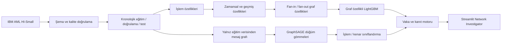

# ARGUS AI — Graf Tabanlı Finansal Suç ve Hesap Ağı İstihbaratı

**Samsung Innovation Campus · Pazarlamada Yapay Zekâ · Capstone Projesi · Grup 3**

> Şüpheli işlemlerden şüpheli ağlara.

ARGUS AI, finansal suç incelemelerinde analistlerin önceliklendirme yapmasına yardımcı
olan, yeniden üretilebilir ve insan denetimli bir araştırma prototipidir. Sistem;
para transferlerini yönlü bir hesap ağı olarak ele alır, işlem özelliklerini geçmiş
ve ağ bağlamıyla birleştirir, şüpheli işlemleri sıralar ve her vaka için incelenebilir
kanıtlar üretir.

ARGUS bir kişi veya hesabın suçlu olduğuna karar vermez. Üretilen skorlar yalnızca
**inceleme önceliğini** gösterir; hukuki karar veya otomatik yaptırım amacıyla
kullanılamaz.

## Proje özeti

Kara para aklama tespitinde tek bir işlemin tutarı veya para birimi çoğu zaman
yeterli değildir. Aynı işlem, gönderen ve alıcı hesapların geçmiş davranışları,
tekrarlanan transferleri ve ağdaki fan-in/fan-out örüntüleriyle birlikte daha anlamlı
hâle gelir. ARGUS bu bağlamı üç model yaklaşımı üzerinden karşılaştırır:

1. işlem tabanlı klasik modeller;
2. zamansal/geçmiş ve graf özellikleri eklenmiş LightGBM;
3. hesap düğümü gömmelerini kullanan GraphSAGE işlem sınıflandırıcısı.

Temel araştırma sorusu şudur:

> Graf bilgisi, ciddi sınıf dengesizliği ve sınırlı alarm bütçesi altında, şüpheli
> işlemlerin önceliklendirilmesini güçlü bir işlem tabanlı modele göre iyileştiriyor mu?

## Güncel durum

| Aşama | Durum | Doğrulanmış çıktı |
| --- | :---: | --- |
| Sprint 1 — Veri temeli ve özellik mühendisliği | **PASS** | 5.078.345 işlemin tam veri akışı |
| Sprint 2 — İşlem tabanlı başlangıç modelleri | **PASS** | Logistic Regression, Random Forest, LightGBM |
| Sprint 3 — Model iyileştirme ve graf değer deneyi | **PASS** | Zamansal çapraz doğrulama, eşik analizi ve özellik ailesi ablasyonu |
| Sprint 4 — GraphSAGE ve ürün katmanı | **PASS** | İşlem düzeyi GNN, vaka/kanıt motoru ve Streamlit |
| Sprint 5 — Tek seferlik final değerlendirme | **PASS** | Donmuş modellerle 761.639 test işlemi |
| Güncel otomatik test paketi | **PASS** | 378 test |

<!-- ARGUS_FINAL_EVALUATION_START -->
### Final bilimsel değerlendirme

Final model, test kümesi açılmadan önce doğrulama (validation) PR-AUC sonucuna göre
**graf özellikli LightGBM** olarak donduruldu. Test sonuçlarından sonra model,
özellik kümesi, hiperparametre veya karar eşiği değiştirilmedi.

| Rol | Model | PR-AUC | ROC-AUC | Precision | Recall | F1 | FPR | Alarm |
| --- | --- | ---: | ---: | ---: | ---: | ---: | ---: | ---: |
| Donmuş final model | Graf özellikli LightGBM | **0,690059** | 0,991272 | 0,178160 | 0,882127 | 0,296448 | 0,008357 | 7.729 |
| Karşılaştırma | İyileştirilmiş işlem LightGBM | 0,530796 | 0,987314 | 0,160723 | 0,814222 | 0,268455 | 0,008732 | 7.908 |
| Karşılaştırma | GraphSAGE işlem sınıflandırıcısı | 0,013417 | 0,826627 | 0,006006 | 0,113389 | 0,011408 | 0,038541 | 29.471 |

Donmuş final modelin operasyonel sıralama sonuçları:

| K | Precision@K | Recall@K | Doğru pozitif |
| ---: | ---: | ---: | ---: |
| 100 | 0,980000 | 0,062780 | 98 |
| 500 | 0,968000 | 0,310058 | 484 |
| 1.000 | 0,839000 | 0,537476 | 839 |

Doğrulama (validation) kümesindeki pozitif oranı `%0,099770`, final testte ise
`%0,204953` olarak ölçüldü. Yaklaşık `2,05×` prevalans artışı nedeniyle precision ve
kesinlik (precision) ve alarm hacmi iki dönem arasında karşılaştırılırken
dikkatli yorumlanmalıdır.

Kalite doğrulaması: **PASS** · 377 test · kayıtlı çıktı doğrulaması PASS.
<!-- ARGUS_FINAL_EVALUATION_END -->

Ayrıntılı ve sürümlenmiş bilimsel kanıtlar:

- [Final değerlendirme raporu](reports/generated/FINAL_EVALUATION_STATUS.md)
- [Final model karşılaştırması](reports/generated/FINAL_MODEL_COMPARISON.md)
- [Model kartı](docs/MODEL_CARD.md)
- [Deney protokolü](docs/EXPERIMENT_PROTOCOL.md)
- [Sprint 1](reports/generated/SPRINT_1_STATUS.md),
  [Sprint 2](reports/generated/SPRINT_2_STATUS.md),
  [Sprint 3](reports/generated/SPRINT_3_STATUS.md) ve
  [Sprint 4](reports/generated/SPRINT_4_STATUS.md) doğrulama raporları
- [Bilimsel final sürümü — `v1.0-scientific-final`](https://github.com/edasaruhan/SIC_AI_17_Capstone_Group_3/tree/v1.0-scientific-final)

## Sistem nasıl çalışır?



Bilimsel protokolün temel kuralları:

- Bölmeler karıştırılmadan, zamana göre oluşturulur; aynı zaman damgasındaki
  işlemler aynı bölümde tutulur.
- Öğrenilen tüm dönüşümler yalnızca eğitim verisi üzerinde öğrenilir (fit edilir);
  doğrulama ve test verileri aynı dönüşümlerle dönüştürülür (transform edilir).
- Geçmiş ve graf özellikleri bir işlem için yalnızca daha eski olayları kullanır.
- IBM etiketi işlem düzeyindedir; desteklenmeyen hesap düzeyi suç etiketi üretilmez.
- Model seçimi doğrulama PR-AUC ile yapılır. Final test yalnızca bir kez,
  doğrulayıcı değerlendirme için açılmıştır.
- Doğruluk (accuracy) ana metrik değildir. PR-AUC, Recall@K, Precision@K, F1, FPR ve alarm
  hacmi birlikte raporlanır.

## Veri kümesi

Projede [IBM AML-Data](https://github.com/IBM/AML-Data) koleksiyonundaki sentetik
**HI-Small** veri kümesinin kullanıcı tarafından sağlanan sabit kopyası kullanıldı.
Ham dosyalar lisans ve boyut nedeniyle GitHub'a yüklenmez.

| Veri | Doğrulanmış değer |
| --- | ---: |
| İşlem | 5.078.345 |
| Hesap kaydı | 518.581 |
| Pozitif işlem | 5.177 |
| Pozitif oran | %0,101943 |
| Zaman aralığı | 1–18 Eylül 2022 |
| Mühendislik sonrası özellik | 34 |

Beklenen yerel dosyalar:

```text
data/raw/HI-Small_Trans.csv
data/raw/HI-Small_accounts.csv
```

Dosya hash'leri, şema ve veri yerleştirme ayrıntıları için
[`data/README.md`](data/README.md) incelenebilir. Ham veri, ara tablolar, model
dosyaları ve çalışma çıktıları `.gitignore` ile Git dışında tutulur.

## Kullanılan yöntemler

| Katman | Yöntem / araç | Amaç |
| --- | --- | --- |
| Veri işleme | Python, pandas, DuckDB | Doğrulama ve tam veri özellik üretimi |
| Başlangıç modelleri | Logistic Regression, Random Forest, LightGBM | İşlem tabanlı referans oluşturma |
| Model iyileştirme | Zamansal çapraz doğrulama, ablasyon | Sızıntısız seçim ve graf katkısını ölçme |
| Graf öğrenmesi | NetworkX, PyTorch, GraphSAGE | Hesap ağı bağlamından düğüm gömmesi üretme |
| Açıklanabilirlik | TreeSHAP, GNN duyarlılık analizi | Model davranışını vaka düzeyinde açıklama |
| İnceleme arayüzü | Streamlit, Plotly | Kuyruk, vaka kanıtı ve model karşılaştırması |
| Kalite | pytest, Ruff | Otomatik test ve statik kalite kontrolleri |

Kaynak sınırları nedeniyle GraphSAGE eğitimi deterministik bir eğitim alt kümesinde
yapılmış, ancak doğrulama işlemlerinin tamamı skorlanmıştır. Bu sonuç tam-graf
GraphSAGE eğitimi olarak sunulmamaktadır.

## Uygulama ekranları

Streamlit uygulaması kayıtlı çalışma çıktılarını okuyarak çalışır ve sayfa açılışında
model eğitmez. Dört görünüm sunar:

- **Executive Dashboard:** Sprint 4 doğrulama önceliklendirme ve vaka özeti;
- **Investigation Queue:** önceliklendirilmiş işlem/vaka kuyruğu;
- **Case Investigator:** işlem, ağ, gözlenen kanıt ve model açıklamaları;
- **Model Comparison:** doğrulama/final model sonuçları ve prevalans kayması.

LLM veya API anahtarı zorunlu değildir. Vaka notları, LLM bulunmadığında yalnızca
kayıtlı kanıtlardan deterministik olarak üretilir.

## Hızlı başlangıç

### 1. Depoyu klonlayın

```powershell
git clone https://github.com/edasaruhan/SIC_AI_17_Capstone_Group_3
Set-Location SIC_AI_17_Capstone_Group_3
```

### 2. Ortamı hazırlayın

Python `3.11–3.13` desteklenir.

```powershell
py -3.12 -m venv .venv
.\.venv\Scripts\python.exe -m pip install --upgrade pip
.\.venv\Scripts\python.exe -m pip install -e ".[graph,app,dev]"
```

### 3. Ham veriyi yerleştirin

IBM HI-Small dosyalarını `data/raw/` altına, yukarıdaki kesin adlarla yerleştirin.
Bu dosyaları `git add -f` ile eklemeyin.

### 4. Kontrolleri ve hızlı veri akışını çalıştırın

```powershell
.\.venv\Scripts\pytest.exe -q
.\.venv\Scripts\python.exe -m ruff check --no-cache src scripts tests app.py
.\.venv\Scripts\python.exe scripts/run_quick_pipeline.py
.\.venv\Scripts\python.exe scripts/verify_run.py
```

Tam yeniden üretim sırası ve donmuş deney kuralları
[`docs/EXPERIMENT_PROTOCOL.md`](docs/EXPERIMENT_PROTOCOL.md) içinde açıklanmıştır.
Tek seferlik final test değerlendirmesi tamamlandığı için README'deki tekrar
çalıştırma komutlarına eklenmemiştir.

### 5. Kayıtlı sonuçlarla uygulamayı açın

```powershell
$env:ARGUS_ARTIFACT_DIR = (Resolve-Path artifacts/sprint5)
.\.venv\Scripts\streamlit.exe run app.py
```

Bu komut için yerel `artifacts/sprint5/` çıktılarının mevcut olması gerekir;
çalışma çıktıları GitHub'a yüklenmez.

## Depo yapısı

```text
configs/                    Donmuş quick/full/model deney ayarları
data/README.md              Veri kaynağı, şema ve yerleştirme bilgisi
data/raw/                   Yerel IBM CSV dosyaları; Git dışında
docs/                       Teknik şartname, protokol, model kartı ve kararlar
notebooks/                  Keşifsel analiz defteri
reports/existing_coursework Ders kapsamında hazırlanan özgün teslim belgeleri
reports/generated/          Sprint ve final doğrulama raporları
scripts/                    Çalıştırma, doğrulama ve kalite komutları
src/argus/                  Veri, model, GNN, vaka, kanıt ve uygulama kodu
tests/                      Otomatik testler
artifacts/                  Yerel çalışma çıktıları; Git dışında
app.py                      Streamlit uygulama giriş noktası
```

## Ders teslimleri

Ders kapsamında aşamalı olarak hazırlanan çalışmalar değiştirilmeden
`reports/existing_coursework/` altında korunmaktadır.

| Aşama | Belge |
| --- | --- |
| Fikir önerisi | [ARGUS AI Capstone Proposal](<reports/existing_coursework/ARGUS_AI_Capstone_Proposal_ (2).pdf>) |
| Literatür, veri ve teknoloji incelemesi | [Literature–Data–Technology Review](<reports/existing_coursework/ARGUS_AI_Literature-Data_Technology_Review (2).docx>) |
| Kavram notu ve uygulama planı | [Concept Note and Implementation Plan](<reports/existing_coursework/ARGUS_AI_Concept_Note_and_Implementation_Plan (1).docx>) |
| Veri hazırlama ve özellik mühendisliği | [Veri Hazırlama ve Özellik Mühendisliği](reports/existing_coursework/ARGUS_AI_Veri_Hazirlama_ve_Ozellik_Muhendisligi.docx) |
| Model iyileştirme şablonu | [Model Refinement Template](<reports/existing_coursework/Model Refinement_Template.docx>) |
| Final sunumu | [ARGUS AI Capstone Project Presentation](<reports/existing_coursework/ARGUS_AI_Capstone_Project_Presentation (3).pptx>) |
| Ana teknik şartname | [ARGUS Codex Master Prompt](reports/existing_coursework/ARGUS_CODEX_MASTER_PROMPT.md) |

## Proje ekibi

| Ekip üyesi | GitHub |
| --- | --- |
| **Gizem Özcan** | [@GizemmOzcan](https://github.com/GizemmOzcan) |
| **Ayşe Ulaşlı** | [@aaayseee](https://github.com/aaayseee) |

ARGUS AI, iki ekip üyesinin ortak capstone çalışmasıdır.

## Sorumlu yapay zekâ ve sınırlılıklar

- Veri kümesi sentetiktir; sonuçlar gerçek bir finans kuruluşuna doğrudan
  genellenemez.
- Model skoru suç kanıtı değildir ve tek başına hesap bloke etme, bildirim yapma
  veya başka bir olumsuz işlem başlatamaz.
- TreeSHAP ve GNN duyarlılık değerleri model davranışını açıklar; nedensel kanıt
  değildir.
- GraphSAGE eğitimi donanım sınırları nedeniyle örneklenmiştir.
- Precision ve alarm hacmi dönemsel pozitif oranından etkilenir.
- Tüm yüksek riskli çıktılar eğitimli bir analist tarafından kaynak kayıtlarla
  birlikte incelenmelidir.

## Dokümantasyon

- [Proje teknik şartnamesi](docs/PROJECT_SPEC.md)
- [Veri sözlüğü](docs/DATA_DICTIONARY.md)
- [Deney protokolü](docs/EXPERIMENT_PROTOCOL.md)
- [Model kartı](docs/MODEL_CARD.md)
- [Mimari karar kayıtları](docs/DECISIONS.md)
- [Yol haritası](docs/ROADMAP.md)

## Lisans

Kaynak kod [MIT Lisansı](LICENSE) ile sunulmaktadır. IBM AML-Data veri kümesi kendi
lisans koşullarına tabidir ve bu deponun MIT lisansı kapsamında değildir.
