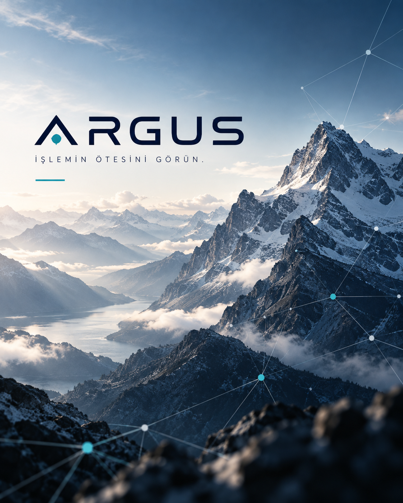
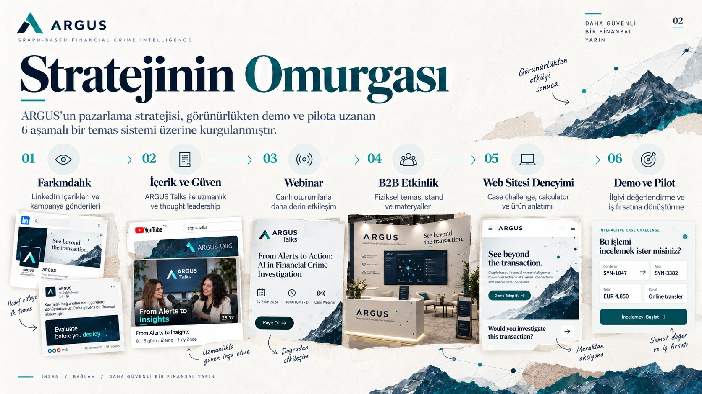
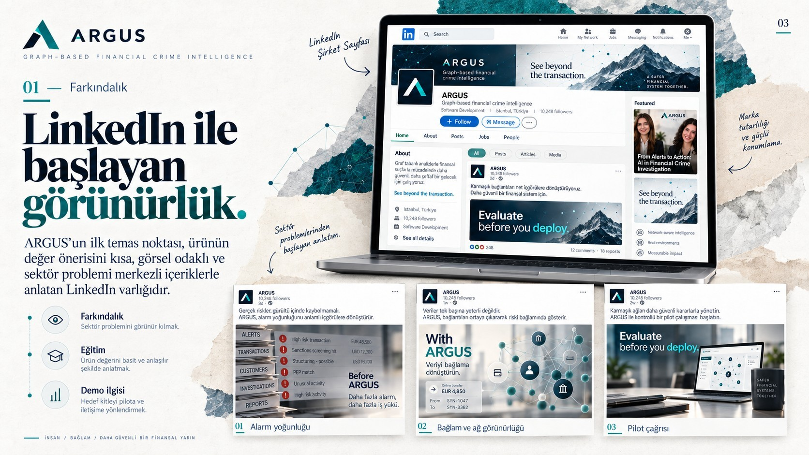
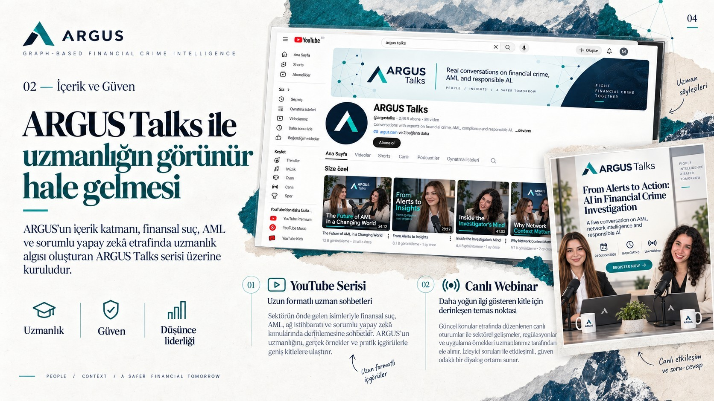
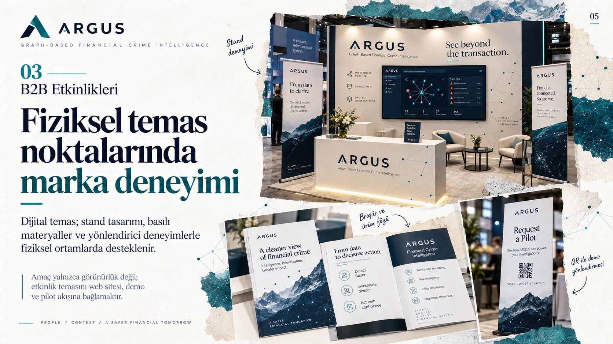
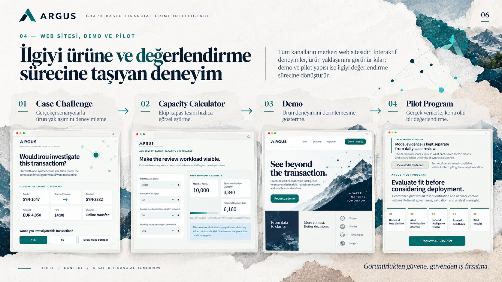
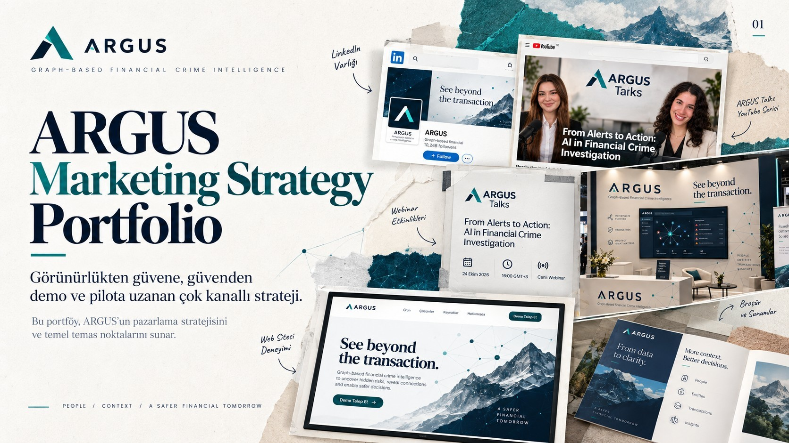
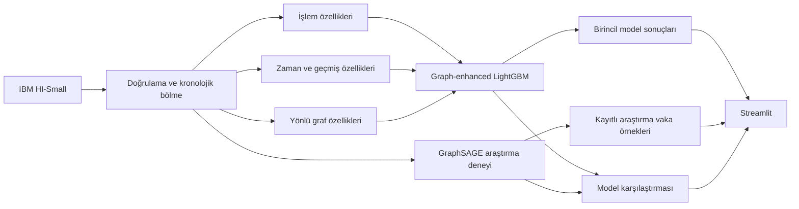

# ARGUS AI

<p align="center">
  
</p>

<p align="center">
  <a href="https://sicai17capstonegroup3-azala6r97tsxkq7fu2loga.streamlit.app/?view=home"></a>
  <a href="https://github.com/edasaruhan/SIC_AI_17_Capstone_Group_3/actions/workflows/quality.yml"></a>
  <a href="https://www.python.org/"></a>
  <a href="LICENSE"></a>
</p>

<p align="center">
  <a href="docs/MODEL_CARD.md"></a>
  <a href="https://github.com/edasaruhan/SIC_AI_17_Capstone_Group_3/tree/v1.0-scientific-final"></a>
</p>

<p align="center">
  <strong>Graph-Based Financial Crime &amp; Account Network Intelligence</strong><br>
  <em>Şüpheli işlemlerden şüpheli ağlara.</em><br>
  <sub>Samsung Innovation Campus · Pazarlamada Yapay Zekâ · Capstone Projesi · Grup 3</sub>
</p>

<p align="center">
  <a href="https://sicai17capstonegroup3-azala6r97tsxkq7fu2loga.streamlit.app/?view=home">Canlı Demo</a> ·
  <a href="#problem-ve-hedef">Problem</a> ·
  <a href="#argus-nasıl-çalışır">Nasıl Çalışır?</a> ·
  <a href="#final-sonuçlar">Bilimsel Sonuçlar</a> ·
  <a href="#analist-ürünü">Analist Ürünü</a> ·
  <a href="#argus-pazarlama-stratejisi">Pazarlama Stratejisi</a> ·
  <a href="#mimari">Mimari</a> ·
  <a href="#dokümantasyon">Dokümantasyon</a> ·
  <a href="#hızlı-başlangıç">Kurulum</a>
</p>

## Yönetici özeti

ARGUS, yüksek hacimli AML alarm kuyruklarında hangi işlemlerin önce incelenmesi gerektiğini
belirlemeye yardımcı olan bir finansal suç karar destek prototipidir. İşlem geçmişini, zamansal
davranışı ve yönlü hesap ağı sinyallerini aynı vaka bağlamında birleştirir; gözlenen kayıtları
model açıklamalarından ayrı sunar ve nihai kararı analiste bırakır.

Birincil sıralama modeli **Graph-enhanced LightGBM**'dir. **GraphSAGE** yalnızca araştırma
karşılaştırıcısıdır. Bilimsel sonuçlar kronolojik ve leakage-safe protokol altında dondurulmuş,
final test yalnızca tek seferlik değerlendirmede açılmıştır.

> [!IMPORTANT]
> ARGUS bir müşteriyi suçlu ilan etmez, hesabı otomatik olarak bloke etmez ve yaptırım kararı
> vermez. Model skoru yalnızca inceleme önceliğidir; her vaka kaynak kayıtlarla birlikte uzman
> analist tarafından değerlendirilmelidir.

## Bir bakışta

| **5.078.345** | **518.581** | **0,690059** | **%98,0** |
| :---: | :---: | :---: | :---: |
| Sentetik HI-Small işlemi | Hesap kaydı | Final test PR-AUC | Final test Precision@100 |

<p align="center"><sub>Dondurulmuş Graph-enhanced LightGBM değerlendirmesi · Final test model seçimi veya tuning için kullanılmadı.</sub></p>

## Ürün yolculuğu

| `01` Problemi görün | `02` Bağlamı keşfedin | `03` Vakayı inceleyin | `04` İnsan kararı verin |
| --- | --- | --- | --- |
| AML alarm yükünü ve önceliklendirme problemini anlayın. | Sentetik Case Challenge ve kapasite hesaplayıcısını deneyin. | Investigation Queue, işlem geçmişi, hesap ağı ve model kanıtını açın. | Not ekleyin; escalate, false-positive veya close kararını oturum içinde kaydedin. |

> [!TIP]
> En kısa ürün turu için önce [canlı Case Challenge'ı](https://sicai17capstonegroup3-azala6r97tsxkq7fu2loga.streamlit.app/?view=home#case-challenge)
> deneyin, ardından `Open Demo` ile Analyst Workspace'e geçin.

## İçindekiler

- [Yönetici özeti](#yönetici-özeti)
- [Bir bakışta](#bir-bakışta)
- [Ürün yolculuğu](#ürün-yolculuğu)
- [Canlı demo](#canlı-demo)
- [Neden ARGUS?](#neden-argus)
- [Problem ve hedef](#problem-ve-hedef)
- [ARGUS nasıl çalışır?](#argus-nasıl-çalışır)
- [Veri ve yöntem](#veri)
- [Final sonuçlar](#final-sonuçlar)
- [Analist ürünü](#analist-ürünü)
- [Public B2B deneyimi](#public-b2b-deneyimi)
- [ARGUS Pazarlama Stratejisi](#argus-pazarlama-stratejisi)
- [Mimari](#mimari)
- [Kurulum ve kalite kontrolleri](#hızlı-başlangıç)
- [Canlı yayın](#canlı-yayın-ve-yeniden-dağıtım)
- [Dokümantasyon](#dokümantasyon)
- [Sınırlılıklar ve sorumlu kullanım](#sınırlılıklar-ve-sorumlu-kullanım)

## Canlı demo

**[ARGUS canlı uygulamasını aç →](https://sicai17capstonegroup3-azala6r97tsxkq7fu2loga.streamlit.app/?view=home)**

| Alan | Demo bilgisi |
| --- | --- |
| Kurumsal e-posta | `analyst@bank.example` |
| Parola | `prototype-access` |
| Ortam | Sentetik ve oturum bazlı ürün demosu |
| Kalıcılık | Notlar ve kararlar çıkış yapıldığında sıfırlanır |

Önerilen kısa demo akışı:

1. `Corporate Login` ile demo çalışma alanına girin.
2. `Overview` ekranında iş yükünü ve sıradaki vakayı görün.
3. `Investigations` ekranında vakaları arayın, filtreleyin ve bir vaka açın.
4. `Case Investigator` içinde önce kayıtları ve ağ bağlamını, ardından model desteğini inceleyin.
5. Analist notu ekleyin ve insan denetimli bir karar kaydedin.
6. `Model Evidence` ekranında model kalitesini, karşılaştırmaları ve sınırlılıkları okuyun.

> **Demo güvenliği:** Bu giriş bilgileri yalnızca herkese açık prototip içindir. Gerçek,
> kişisel veya kurumsal parolalar kullanmayın. Canlı arayüzdeki walkthrough vakaları
> sentetiktir; aşağıdaki dondurulmuş bilimsel sonuçların yeniden üretimi değildir.

## Neden ARGUS?

| Ağ bağlamı | Bilimsel disiplin | İnsan denetimi |
| --- | --- | --- |
| Tekil transferin ötesinde gönderici, alıcı, geçmiş ve yönlü bağlantıları aynı vakada gösterir. | Train-fit/validation-test-transform disiplini, kronolojik split, frozen artifact doğrulaması ve otomatik kalite kapıları kullanır. | Gözlenen kanıtı model desteğinden ayırır; karar ve gerekçe analiste aittir. |

| Operasyonel görünüm | Açıklanabilirlik | Araştırma karşılaştırması |
| --- | --- | --- |
| Önceliklendirilmiş kuyruk, filtreleme, vaka özeti ve oturuma özel aksiyonlar sunar. | TreeSHAP, kayıt-temelli ağ kanıtları ve model provenance bilgisini görünür tutar. | Transaction LightGBM ve GraphSAGE sonuçlarını birincil graph-enhanced modelle aynı protokol bağlamında raporlar. |

## Problem ve hedef

Tekil işlemler olağan görünürken hesaplar arasındaki toplama, dağıtma, hızlı aktarım
ve tekrarlı transfer örüntüleri birlikte şüpheli olabilir. ARGUS iki soruya odaklanır:

- ağ bağlamı, güçlü bir işlem modeline ölçülebilir katkı sağlıyor mu;
- sınırlı inceleme kapasitesinde hangi işlemler ve hesap ağları önce ele alınmalı?

Sistem otomatik yaptırım uygulamaz. Üretilen skorlar yalnızca inceleme önceliğidir.

## ARGUS nasıl çalışır?

1. IBM AML HI-Small işlemleri şema ve veri kalitesi kontrollerinden geçirilir.
2. İşlemler zaman sırası korunarak eğitim, doğrulama ve final test bölümlerine ayrılır.
3. İşlem, zaman, geçmiş ve yönlü graf özellikleri yalnız geçmiş olaylardan üretilir.
4. Transaction LightGBM, graph-enhanced LightGBM ve GraphSAGE aynı kronolojik
   protokolde karşılaştırılır.
5. Graph-enhanced LightGBM birincil sıralama modeli olarak kullanılır.
6. Vaka ekranı gözlenen kanıtı model açıklamasından ayrı gösterir.

## Veri

Çalışmada [IBM AML-Data](https://github.com/IBM/AML-Data) koleksiyonundaki sentetik
**HI-Small** veri kümesi kullanılmıştır.

| Özellik | Değer |
| --- | ---: |
| İşlem sayısı | 5.078.345 |
| Hesap kaydı | 518.581 |
| Pozitif işlem | 5.177 |
| Pozitif oran | %0,101943 |
| Zaman aralığı | 1–18 Eylül 2022 |
| Final test işlemi | 761.639 |

Ham CSV dosyaları lisans ve boyut nedeniyle Git tarafından izlenmez. Yerel dosya
adları, SHA-256 değerleri ve şema bilgisi [`data/README.md`](data/README.md)
dosyasındadır.

## Yöntem

| Katman | Yaklaşım |
| --- | --- |
| İşlem modeli | Logistic Regression, Random Forest, LightGBM |
| Özellik aileleri | İşlem → zaman/geçmiş → yönlü graf |
| Model seçimi | Zamansal çapraz doğrulama ve doğrulama PR-AUC |
| Operasyonel eşik | Doğrulama üzerinde alarm bütçesi ve FPR/Recall dengesi |
| Graf deneyi | Gönderen/alıcı GraphSAGE embedding'leriyle işlem sınıflandırma |
| Açıklanabilirlik | TreeSHAP, GNN yerel duyarlılık ve gözlenen ağ kanıtları |
| Ürün katmanı | Streamlit inceleme kuyruğu ve vaka ekranı |

Tüm öğrenilen dönüşümler eğitim verisine fit edilir; doğrulama ve test yalnız
transform edilir. Aynı zaman damgasındaki işlemler aynı bölümde tutulur. Geçmiş
özellikleri, incelenen işlemle aynı anda veya daha sonra gerçekleşen olayları kullanmaz.

### Teknoloji yığını

| Alan | Teknolojiler |
| --- | --- |
| Veri işleme | Python, Pandas, NumPy, DuckDB |
| Makine öğrenmesi | scikit-learn, LightGBM |
| Graf öğrenmesi | PyTorch, GraphSAGE, NetworkX |
| Açıklanabilirlik | SHAP ve kayıt-temelli ağ kanıtları |
| Ürün arayüzü | Streamlit, Plotly |
| Kalite güvencesi | Pytest, Ruff, coverage, GitHub Actions |

## Final sonuçlar

Final model ve karar eşiği doğrulama sonuçlarıyla dondurulduktan sonra test bölümü
tek kez değerlendirilmiştir. Test sonucu model seçimi veya ayarlama için
kullanılmamıştır.

| Rol | Model | PR-AUC | ROC-AUC | Precision | Recall | F1 | FPR | Alarm |
| --- | --- | ---: | ---: | ---: | ---: | ---: | ---: | ---: |
| **Final model** | **Graph-enhanced LightGBM** | **0,690059** | 0,991272 | 0,178160 | 0,882127 | 0,296448 | 0,008357 | 7.729 |
| Karşılaştırma | Refined transaction LightGBM | 0,530796 | 0,987314 | 0,160723 | 0,814222 | 0,268455 | 0,008732 | 7.908 |
| Araştırma karşılaştırması | GraphSAGE | 0,013417 | 0,826627 | 0,006006 | 0,113389 | 0,011408 | 0,038541 | 29.471 |

Final model için sıralama performansı:

| K | Precision@K | Recall@K | Doğru pozitif |
| ---: | ---: | ---: | ---: |
| 100 | 0,980000 | 0,062780 | 98 |
| 500 | 0,968000 | 0,310058 | 484 |
| 1.000 | 0,839000 | 0,537476 | 839 |

Pozitif oran doğrulamada `%0,099770`, final testte `%0,204953` olmuştur. Bu `2,05×`
prevalans farkı precision ve alarm hacmini etkiler; iki dönem bu bağlamla birlikte
yorumlanmalıdır.

Ayrıntılı sonuçlar:

- [Final değerlendirme özeti](reports/generated/FINAL_EVALUATION_STATUS.md)
- [Final model karşılaştırması](reports/generated/FINAL_MODEL_COMPARISON.md)
- [Model kartı](docs/MODEL_CARD.md)
- [Deney protokolü](docs/EXPERIMENT_PROTOCOL.md)
- [Bilimsel final etiketi: `v1.0-scientific-final`](https://github.com/edasaruhan/SIC_AI_17_Capstone_Group_3/tree/v1.0-scientific-final)

## Graf katkısı

Aynı LightGBM ailesi ve aynı doğrulama protokolüyle yapılan özellik ablasyonu:

| Özellik ailesi | Doğrulama PR-AUC |
| --- | ---: |
| Yalnız işlem | 0,099841 |
| İşlem + zaman/geçmiş | 0,355350 |
| İşlem + zaman/geçmiş + graf | **0,471754** |

Graf özellikleri son iki kol arasında PR-AUC'yi `+0,116404` artırmıştır. Örneklenmiş
GraphSAGE deneyi graph-enhanced LightGBM'i geçmemiştir; bu nedenle araştırma
karşılaştırması olarak tutulur.

## Analist ürünü

Ürün akışı **Public Website → Corporate Login → Analyst Portal** şeklindedir. Kurumsal giriş,
üretim kimlik sağlayıcısına bağlı olmayan güvenli bir demo oturumudur. Streamlit uygulaması
kayıtlı artifact'ları salt okunur biçimde kullanır ve sayfa açılışında model eğitmez.
Graph-enhanced LightGBM birincil sıralama modelidir. Uygulamadaki mevcut kayıtlı vaka
örnekleri GraphSAGE araştırma karşılaştırmasına ait artifact setinden alınır.

- **Overview:** inceleme bekleyen vakalar, öncelik dağılımı ve oturum etkinliği;
- **Investigations:** aranabilir, filtrelenebilir ve sıralanabilir vaka çalışma listesi;
- **Case Investigator:** yönlü hesap ağı, işlem zaman çizelgesi, gözlenen kanıtlar ve
  oturuma özel analist aksiyonları;
- **Model Evidence:** dondurulmuş final model, transaction baseline ve GraphSAGE
  karşılaştırması.

Kurumsal giriş bilgileri ve vaka aksiyonları kalıcı olarak saklanmaz; çıkış yapıldığında demo
oturumu temizlenir.

## Public B2B deneyimi

Herkese açık deneyim, ziyaretçiyi **Farkındalık → Ürünü anlama → Etkileşimli deneyim →
ARGUS demosu → Pilot fırsatı** akışında yönlendirir. Açılış sayfası problem ve ürün yaklaşımını,
`Before ARGUS / With ARGUS` karşılaştırmasını, etkileşimli vaka senaryosunu, kapasite
hesaplayıcısını, kaynak alanını ve kontrollü pilot programını tek bir yolculukta birleştirir.
`Open Demo`, mevcut kurumsal demo girişi üzerinden analist portalına gider; iç geliştirme veya
yönetim işlevleri herkese açık gezinmede yer almaz.

`Would You Investigate This Transaction?` vaka senaryosu bütünüyle sentetik ve açıklayıcıdır.
Gerçek bir soruşturma, IBM HI-Small kaydı, dondurulmuş model çıktısı veya bilimsel sonuç değildir;
yanıtlar suç, yaptırım ya da otomatik karar anlamına gelmez.

AML inceleme kapasitesi hesaplayıcısı yalnızca kullanıcının girdiği iş yükünü şu formüllerle
görselleştirir:

```text
tahmini aylık inceleme kapasitesi = analist sayısı × analist başına aylık çalışma saati × 60 / vaka başına ortalama dakika
potansiyel kapasite açığı = max(0, aylık alarm sayısı - tahmini inceleme kapasitesi)
```

Hesaplayıcı ARGUS performansını, verimlilik artışını veya garanti edilen bir kazanımı tahmin etmez.
Pilot talep formu alanları yalnızca aktif Streamlit oturumunda doğrular; CRM, e-posta veya kalıcı
veri tabanı entegrasyonu yoktur, istek gönderilmez ve form verisi proje artifact'larına yazılmaz.

Konumlandırma, hedef kitle, pazarlama hunisi, içerik planı ve claim/provenance sınırları için
[`docs/marketing/README.md`](docs/marketing/README.md) dosyasına bakın.

## ARGUS Pazarlama Stratejisi

ARGUS'un pazarlama stratejisi; banka ve fintech dünyasındaki AML, Fraud, Compliance ve
Financial Crime karar vericilerinde görünürlük oluşturmak, uzmanlık ve güven geliştirmek ve
ilgiyi ürün deneyimi, demo ve kontrollü pilot değerlendirmesine taşımak üzere tasarlanmıştır.
Tek bir kampanya yerine, birbirini tamamlayan temas noktalarından oluşan önerilen bir B2B
müşteri yolculuğudur.

> [!NOTE]
> Bu bölüm uygulanmış kampanya sonuçlarını değil, ARGUS için tasarlanan pazarlama konseptini
> gösterir. Görsellerdeki kanal sayıları, kişiler, etkinlikler, tarihler, arayüz değerleri ve QR
> kodları; gerçek müşteri, kampanya performansı, üretim kurulumu veya bilimsel sonuç kanıtı değildir.

### Strateji omurgası

<p align="center">
  
</p>

| Aşama | Önerilen rol |
| --- | --- |
| **01 · Farkındalık** | LinkedIn'de problem odaklı içeriklerle ilk temas kurmak |
| **02 · İçerik ve Güven** | ARGUS Talks ile uzmanlık ve düşünce liderliği geliştirmek |
| **03 · Webinar** | Belirli sektör problemlerini canlı ve daha derin bir etkileşimde ele almak |
| **04 · B2B Etkinlik** | Dijital görünürlüğü yüz yüze ürün anlatımıyla birleştirmek |
| **05 · Web Sitesi ve Ürün Deneyimi** | Case Challenge ve kapasite hesaplayıcısıyla yaklaşımı deneyimletmek |
| **06 · Demo ve Pilot** | İlgiyi kontrollü değerlendirme ve pilot görüşmesine taşımak |

### 01 — Farkındalık: LinkedIn

<p align="center">
  
</p>

LinkedIn, önerilen stratejinin ilk düzenli B2B temas noktasıdır. İçerik sistemi; **problem**
(alarm yükü ve önceliklendirme), **eğitim** (ağ bağlamı ve insan denetimli yapay zekâ) ve
**dönüşüm** (ürün demosu ve kontrollü pilot ilgisi) katmanlarından oluşur. Görsellerdeki takipçi
ve etkileşim sayıları yalnızca tasarım mockup'ıdır; gerçekleşmiş kanal performansı değildir.

### 02 — İçerik ve Güven: ARGUS Talks

<p align="center">
  
</p>

**ARGUS Talks**, finansal suç, AML, Fraud, Compliance, ağ zekâsı ve sorumlu yapay zekâ
çevresinde kurgulanan bir thought-leadership içerik serisidir. Uzun formatlı içeriklerin
YouTube'da, seçili kısa kesitlerin LinkedIn'de değerlendirilmesi; webinarların ise daha yüksek
etkileşimli bir katman oluşturması önerilir. Görseldeki kanal istatistikleri, konuklar ve webinar
duyurusu konsepttir; gerçekleşmiş yayın veya etkinlik iddiası taşımaz.

### 03 — B2B Etkinlikleri

<p align="center">
  
</p>

Önerilen fiziksel deneyim; sade bir standı, ürün ekranlarını, kısa ürün anlatımını, broşür veya
ürün föyünü ve web sitesi, demo ya da pilot sayfasına yönlendiren QR temaslarını bir araya getirir.
Amaç, dijital farkındalığı bağımsız bir etkinlikte bırakmadan yeniden ölçülebilir dijital yolculuğa
bağlamaktır. Bu çalışmalar gerçek bir fuar katılımı veya toplanmış müşteri adayı kanıtı değildir.

### 04 — Web Sitesi, Demo ve Pilot

<p align="center">
  
</p>

Önerilen dönüşüm yolu **Case Challenge → Capacity Calculator → Product Demo → Controlled
Pilot** şeklindedir. Case Challenge sentetik ve açıklayıcıdır. Capacity Calculator yalnızca
kullanıcı girdileriyle iş yükünü görselleştirir; ARGUS'un sağlayacağı verimlilik artışını tahmin
etmez. Demo, analist iş akışını gösterir; pilot ise üretim veya performans garantisi değil,
yönetişim altında yürütülecek kontrollü bir değerlendirme çerçevesidir.

### Pazarlama teslimleri

| Pazarlama teslimi | Dosya |
| --- | --- |
| Pazarlama Stratejisi Raporu | [PDF](docs/marketing/ARGUS_Marketing_Strategy_Report.pdf) |
| Pazarlama Stratejisi Portfolyosu | [PDF](docs/marketing/ARGUS_Marketing_Strategy_Portfolio.pdf) |
| Marketing Documentation | [README](docs/marketing/README.md) |

<p align="center">
  <a href="docs/marketing/ARGUS_Marketing_Strategy_Portfolio.pdf">
    
  </a>
</p>

<p align="center"><sub>ARGUS için tasarlanan çok kanallı B2B pazarlama stratejisinin görsel portfolyosu.</sub></p>

## Mimari


```mermaid
flowchart LR
    A[IBM HI-Small] --> B[Doğrulama ve kronolojik bölme]
    B --> C[İşlem özellikleri]
    B --> D[Zaman ve geçmiş özellikleri]
    B --> E[Yönlü graf özellikleri]
    C --> F[Graph-enhanced LightGBM]
    D --> F
    E --> F
    B --> G[GraphSAGE araştırma deneyi]
    F --> H[Birincil model sonuçları]
    G --> I[Kayıtlı araştırma vaka örnekleri]
    F --> K[Model karşılaştırması]
    G --> K
    H --> J[Streamlit]
    I --> J
    K --> J
```

Ana bileşenler:

```text
configs/             Deney ayarları
data/README.md       Veri şeması ve yerel dosya bilgisi
docs/                Protokol, model kartı ve teknik kararlar
reports/coursework/  Altı temel ders teslimi
reports/generated/   Final bilimsel sonuç özetleri
scripts/             Pipeline, doğrulama ve kalite komutları
src/argus/           Veri, model, GNN, vaka ve uygulama kodu
tests/               Otomatik testler
artifacts/           Yerel çalışma çıktıları; Git dışında
demo/artifacts/      Temiz klon için sentetik ürün demosu
```

## Hızlı başlangıç

Python `3.11–3.13` desteklenir.

```powershell
git clone https://github.com/edasaruhan/SIC_AI_17_Capstone_Group_3
Set-Location SIC_AI_17_Capstone_Group_3
py -3.12 -m venv .venv
.\.venv\Scripts\python.exe -m pip install --upgrade pip
.\.venv\Scripts\python.exe -m pip install -e ".[graph,app,dev]"
```

### Dev Container ve GitHub Codespaces

Depo, Python `3.12` tabanlı hazır bir geliştirme konteyneri içerir. GitHub'da
**Code → Codespaces → Create codespace** seçildiğinde kilitli geliştirme bağımlılıkları
kurulur, Pytest ve Ruff VS Code'a bağlanır ve Streamlit uygulaması `8501` portunda başlatılır.
Konteyner yapılandırması CORS veya XSRF korumalarını kapatmaz.

GNU Make kullanılan geliştirme ortamlarında tam CI karşılığı kontrol tek komutla çalışır:

```bash
make check
```

Uygulamayı ayrıca başlatmak için `make app` kullanılabilir.

GNU Make bulunan ortamlarda aynı tam geliştirme kurulumu `make setup`, çekirdek ve
geliştirme araçlarıyla sınırlı hafif kurulum ise `make setup-core` ile yapılabilir. Python 3.12
üzerinde doğrulanmış doğrudan bağımlılık sürümleriyle tekrarlanabilir QA kurulumu için
`make setup-locked` kullanılır. Bu constraints dosyası yazılım kalite ortamını sabitler; frozen
bilimsel eğitim çalışmasını yeniden üretme iddiası taşımaz.

HI-Small dosyalarını aşağıdaki yerel yollara ekleyin:

```text
data/raw/HI-Small_Trans.csv
data/raw/HI-Small_accounts.csv
```

Veri ve kalite kontrolleri:

```powershell
.\.venv\Scripts\python.exe -m pytest -q
.\.venv\Scripts\python.exe -m pytest --cov=argus --cov-report=term-missing --cov-fail-under=77
.\.venv\Scripts\python.exe -m ruff check --no-cache src scripts tests app.py
.\.venv\Scripts\python.exe -m ruff format --no-cache --check src scripts tests app.py
.\.venv\Scripts\python.exe -m pip check
.\.venv\Scripts\python.exe scripts/run_quick_pipeline.py
.\.venv\Scripts\python.exe scripts/verify_run.py
```

Final test pipeline'ı tekrar çalıştırılmaz. Kayıtlı final sonuçlarının salt-okunur
doğrulaması için:

```powershell
.\.venv\Scripts\python.exe scripts/verify_final_evaluation.py --config configs/final_evaluation.yaml
```

`artifacts/` veri, model, tahmin ve ekran görüntüsü çıktıları boyut ve veri politikası
nedeniyle Git'e eklenmez. Bu nedenle temiz bir klonda yalnızca özet raporlar bulunur;
artifact içindeki kanıt yolları, doğrulanmış yerel paket geri yüklendiğinde kullanılabilir.

Yerel final artifact'ları mevcutsa uygulama şu komutla açılır:

```powershell
$env:ARGUS_ARTIFACT_DIR = (Resolve-Path artifacts/sprint5)
.\.venv\Scripts\streamlit.exe run app.py
```

Gerçek artifact paketi bulunmayan temiz bir klonda uygulama otomatik olarak
`demo/artifacts/dashboard_bundle.json` içindeki küçük sentetik ürün demosunu açar. Bu vakalar
yalnızca arayüz akışını göstermek içindir; IBM HI-Small kaydı, frozen model çıktısı veya bilimsel
sonuç değildir. `ARGUS_ARTIFACT_DIR` verilirse açıkça seçilen gerçek paket her zaman önceliklidir.
Demo vaka içeriğinin provenance sözleşmesi otomatik testlerle, lint ve en az `%77` coverage
eşiği ise GitHub Actions kalite iş akışıyla korunur.

## Canlı yayın ve yeniden dağıtım

Mevcut yayın:

- **Uygulama:** [sicai17capstonegroup3-azala6r97tsxkq7fu2loga.streamlit.app](https://sicai17capstonegroup3-azala6r97tsxkq7fu2loga.streamlit.app/?view=home)
- **Ana kaynak depo:** [edasaruhan/SIC_AI_17_Capstone_Group_3](https://github.com/edasaruhan/SIC_AI_17_Capstone_Group_3)
- **Yayın kaynağı:** [aaayseee/SIC_AI_17_Capstone_Group_3](https://github.com/aaayseee/SIC_AI_17_Capstone_Group_3)

Streamlit Community Cloud depo yönetim yetkisi istediği için mevcut canlı demo, ana depoyla
senkron tutulan yayın kaynağından çalışır. Ürün kodu ve `main` dalı iki depoda aynıdır.

Depo, kökteki `app.py`, `.streamlit/config.toml`, `requirements.txt` ve izlenen sentetik demo
artifact'iyle doğrudan Streamlit Community Cloud'a yayınlanabilir:

1. `share.streamlit.io` üzerinde GitHub hesabını bağlayıp **Create app** seçin.
2. Yönetim yetkiniz bulunan senkron depoyu seçin; branch olarak `main`, entrypoint olarak
   `app.py` girin.
3. **Advanced settings** altında Python `3.12` seçin.
4. Secrets alanını boş bırakın. İzlenen sentetik demo, harici servis veya API anahtarı olmadan
   çalışır ve açıkça etiketlenen prototip giriş formunu kullanır.

Canlı uygulama yalnızca repoda izlenen sentetik demo paketini kullanır; yerel `artifacts/` ve ham
IBM AML verileri deploy edilmez.

Tam çalıştırma sırası [`docs/EXPERIMENT_PROTOCOL.md`](docs/EXPERIMENT_PROTOCOL.md)
dosyasındadır.

## Dokümantasyon

| Belge | İçerik |
| --- | --- |
| [Model Card](docs/MODEL_CARD.md) | Model performansı, davranışı, kullanım sınırları ve final model rolü |
| [Experiment Protocol](docs/EXPERIMENT_PROTOCOL.md) | Kronolojik deney, doğrulama ve final test protokolü |
| [Project Spec](docs/PROJECT_SPEC.md) | Proje kapsamı ve teknik sistem tanımı |
| [Data Dictionary](docs/DATA_DICTIONARY.md) | Veri alanları ve türetilen özelliklerin sözlüğü |
| [Decision Log](docs/DECISIONS.md) | Önemli teknik ve bilimsel kararların kaydı |
| [Marketing Strategy Report](docs/marketing/ARGUS_Marketing_Strategy_Report.pdf) | Önerilen B2B pazarlama stratejisinin ayrıntılı raporu |
| [Marketing Strategy Portfolio](docs/marketing/ARGUS_Marketing_Strategy_Portfolio.pdf) | Tasarlanan pazarlama stratejisinin konsept görsel portfolyosu |
| [Marketing README](docs/marketing/README.md) | Konumlandırma, pazarlama hunisi ve claim/provenance sınırları |
| [Coursework](reports/coursework/README.md) | Samsung Innovation Campus ders teslimleri |

## Ders teslimleri

| Teslim | Dosya |
| --- | --- |
| Idea Proposal | [PDF](reports/coursework/01_Idea_Proposal/ARGUS_AI_Capstone_Proposal.pdf) · [PPTX](reports/coursework/01_Idea_Proposal/ARGUS_AI_Capstone_Project_Presentation.pptx) |
| Literature, Data & Technology Review | [DOCX](reports/coursework/02_Literature_Data_Technology/ARGUS_AI_Literature_Data_Technology_Review.docx) |
| Concept Note & Implementation Plan | [DOCX](reports/coursework/03_Concept_Implementation/ARGUS_AI_Concept_Note_and_Implementation_Plan.docx) |
| Data Preparation & Feature Engineering | [DOCX](reports/coursework/04_Data_Preparation/ARGUS_AI_Veri_Hazirlama_ve_Ozellik_Muhendisligi.docx) |
| Model Refinement & Test Submission | [PDF](reports/coursework/05_Model_Refinement_and_Test_Submission/ARGUS_Model_Refinement_ve_Test_Submission_TR.pdf) |
| Deployment Submission | [DOCX](reports/coursework/06_Deployment_Submission/ARGUS_AI_Deployment_Submission_TR.docx) |

Ayrı indeks: [`reports/coursework/README.md`](reports/coursework/README.md).

## Sınırlılıklar ve sorumlu kullanım

- HI-Small sentetik bir veri kümesidir; sonuçlar gerçek banka verisine doğrudan
  genellenemez.
- Pozitif sınıf son derece dengesizdir. Accuracy tek başına anlamlı bir başarı
  ölçütü değildir.
- GraphSAGE eğitimi deterministik örneklenmiş bir graf üzerinde yapılmıştır; sonuç
  tam-graf eğitim iddiası taşımaz.
- TreeSHAP ve GNN duyarlılığı model davranışını açıklar, nedensellik göstermez.
- Model skoru suç kanıtı değildir ve otomatik bloke etme ya da yaptırım amacıyla
  kullanılmamalıdır.
- Her yüksek öncelikli vaka, kaynak kayıtlarla birlikte uzman analist tarafından
  incelenmelidir.

## Ekip

| Ekip üyesi | GitHub |
| --- | --- |
| **Gizem Özcan** | [@GizemmOzcan](https://github.com/GizemmOzcan) |
| **Ayşe Ulaşlı** | [@aaayseee](https://github.com/aaayseee) |

## Lisans

Kaynak kod [MIT Lisansı](LICENSE) ile sunulur. IBM AML-Data veri kümesi kendi lisans
koşullarına tabidir ve bu deponun MIT lisansı kapsamında değildir.
